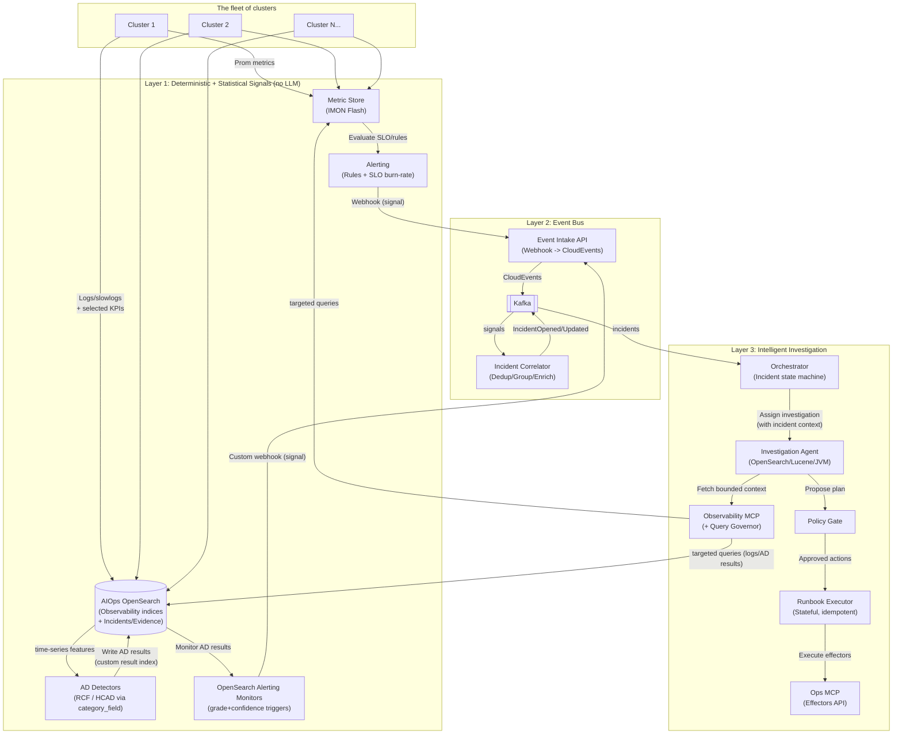
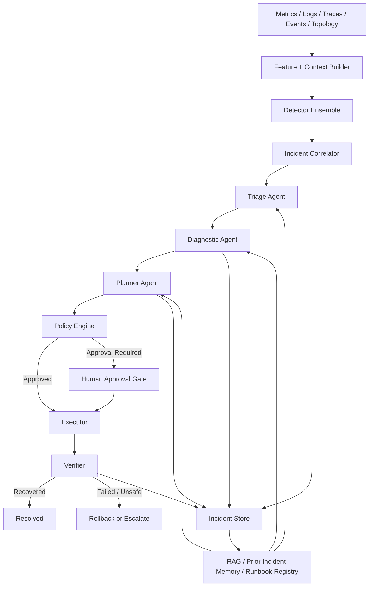
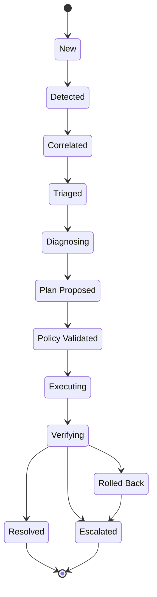
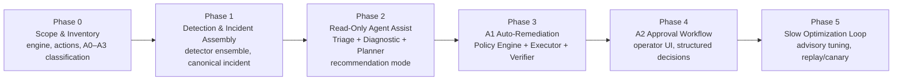

# Autonomous Database Maintenance Control Plane
**Status:** Draft  

## 1. Purpose

This document defines a concrete architecture for an AI agent-based maintenance pipeline for managed database infrastructure. The goal is to reduce Mean Time to Detection (MTTD) and Mean Time to Resolution (MTTR) for common operational failures while preserving reliability, limiting blast radius, and keeping humans in control of high-risk changes.

This is not a general-purpose “DBA agent.” It is a **policy-governed control plane** that combines signal processing, bounded agent reasoning, deterministic execution, and staged autonomy.

## 2. Goals and Non-Goals

### Goals
- Detect operational anomalies earlier than threshold-only monitoring.
- Correlate telemetry, changes, and topology into a single incident object.
- Diagnose common incidents with bounded agent workflows.
- Auto-execute a narrow set of reversible, low-risk remediations.
- Route high-risk actions through approval gates.
- Learn from prior incidents, human approvals, and rejected plans.

### Non-Goals
- Arbitrary shell access from an LLM.
- Arbitrary SQL execution from an LLM.
- Fully autonomous schema migration, failover, or destructive maintenance.
- Real-time RL-driven physical design changes in the incident loop.
- Replacing DBAs or SREs for novel, high-severity incidents.

## 3. Design Principles

1. **Separate fast incident response from slow optimization.**  
   Fast loops handle incidents in seconds to minutes. Slow loops handle tuning and physical design over hours to days.

2. **Use the LLM for reasoning, not authority.**  
   The LLM proposes a typed plan. A deterministic policy engine and executor decide whether anything runs.

3. **Prefer structured context over long prompts.**  
   Incident state, topology, SLOs, recent changes, and allowed actions matter more than prompt verbosity.

4. **Auto-execute only reversible, low-blast-radius actions.**  
   Anything affecting primaries, write paths, or persistent data layout requires approval.

5. **Treat logs, SQL text, and telemetry as untrusted input.**  
   Prompt injection and telemetry manipulation are real threats.

## 4. Scope

The initial production slice should be intentionally narrow.

### Supported incident classes
- Lock contention
- Runaway queries
- Replica lag
- Connection storms
- Memory saturation
- Disk/storage saturation
- Read replica health degradation

### Supported auto-remediation actions (A1)
- Cancel query by PID or fingerprint
- Pause noisy background job
- Restart unhealthy replica
- Remove degraded replica from read routing
- Scale read pool within fixed bounds
- Trigger approved maintenance task

Parameter changes on primaries are A2: the system may recommend them but must not auto-run them. See §12 for the full autonomy model.

### Explicitly excluded
- Primary failover without approval
- Arbitrary DDL
- Schema migration
- Cross-region promotion
- Autonomous index creation on primaries
- Arbitrary shell commands

## 5. High-Level Architecture

The architecture is described from two complementary views: a concrete reference implementation and a logical agent pipeline.

### 5.1 Reference Implementation

A representative deployment using OpenSearch for evidence storage, anomaly-detection results, and alerting, with Kafka as the event bus between layers.



### 5.2 Logical Agent Pipeline

The canonical stages each incident passes through. The Orchestrator (§8 state machine) drives the transitions between stages; it is omitted as a node to keep the diagram focused on the pipeline.



## 6. Logical Layers

### 6.1 Perception Layer

The Perception Layer turns raw telemetry into canonical incident objects. It does not rely on a single model; it uses a detector ensemble:

- **Hard guards:** fixed thresholds for catastrophic states
- **Seasonal baselines:** workload-aware time-series expectations
- **Multivariate anomaly detection:** unusual combinations of signals
- **Change-point detection:** step changes after deploys, config edits, or traffic shifts

Detector outputs are deterministic incident candidates, not raw telemetry. An **Incident Correlator** then deduplicates overlapping signals, groups them by cluster/service/index within a time window, enriches each group with recent deploy/config/schema changes, and manages the incident lifecycle (open/update/close). Its output is the canonical incident object (§7) consumed by the Reasoning Layer.

### 6.2 Reasoning Layer

The Reasoning Layer uses bounded agents with distinct roles, coordinated by the Orchestrator.

- **Orchestrator:** incident state machine. Drives the investigation loop, enforces step and concurrency budgets, decides when to escalate or request approval, and hands typed plans to the Executor.
- **Triage Agent:** classifies incident type, severity, and blast radius. Read-only.
- **Diagnostic Agent:** forms and eliminates root-cause hypotheses, requests missing evidence, and produces a narrowed diagnosis. Read-only. Does not propose actions.
- **Planner Agent:** selects an approved runbook, binds its parameters, and produces a typed, machine-checkable plan. Cannot invent new action types.

These agents operate on structured context plus retrieved runbooks and prior incident memory. Full agent contracts are in §9.

### 6.3 Control Layer

The Control Layer is deterministic and non-negotiable.

- **Policy Engine:** validates whether a proposed action is allowed
  - Risk classification
  - Blast-radius constraints
  - Environment constraints ("prod requires approval")
  - Allowlist/denylist of actions
- **Executor:** performs typed actions only
  - Step execution
  - Retries and timeouts
  - Outcome recording
- **Verifier (post-evaluator):** checks recovery and triggers rollback or escalation

This is the safety boundary. The LLM never bypasses it.

## 7. Incident Contract

Every stage operates on the same canonical incident object.

```json
{
  "incident_id": "inc_2026_03_09_001247",
  "status": "DIAGNOSING",
  "timestamp": "2026-03-09T10:23:11Z",
  "resource": {
    "service": "payments-db",
    "engine": "postgresql",
    "engine_version": "15.x",
    "cluster": "payments-prod-apne2",
    "node": "replica-03",
    "role": "replica"
  },
  "severity": "SEV2",
  "blast_radius": "single_node",
  "tenant_impact": {
    "tenants_affected": 3,
    "tier": "gold"
  },
  "signals": [
    {
      "name": "replication_lag_seconds",
      "window": "5m",
      "current": 18.2,
      "baseline": 1.3,
      "direction": "HIGH",
      "scores": {
        "seasonal": 0.92,
        "multivariate": 0.88,
        "change_point": 1.0
      }
    }
  ],
  "correlated_events": [
    {
      "type": "deploy",
      "id": "dep_884191",
      "age_seconds": 420
    }
  ],
  "top_evidence": [
    "Replica apply queue rising for 4m",
    "Disk read IOPS +346% above baseline",
    "Top query fingerprint 0x87af accounts for 41% of read load"
  ],
  "policy_context": {
    "autonomy_level": "A1",
    "allowed_actions": [
      "route_reads_away_from_replica",
      "restart_replica",
      "scale_read_pool"
    ],
    "forbidden_actions": [
      "promote_replica",
      "modify_primary_parameters",
      "execute_ddl"
    ]
  },
  "recent_attempts": []
}
```

## 8. State Machine

Incidents follow a strict lifecycle.



### State Machine Rules
- Maximum diagnostic steps per incident: `5`
- Maximum autonomous execution attempts per incident: `1` by default
- No repeated identical action without new evidence
- Every executable runbook must define a verification window
- Verification failure triggers rollback if possible; otherwise escalation

## 9. Agent Topology and Responsibilities

### Triage Agent
Input:
- incident object
- recent correlated events
- topology and SLO status

Output:
- incident category
- likely severity
- blast radius estimate
- recommended next evidence to collect

Constraints:
- read-only tools only
- no action planning

### Diagnostic Agent
Input:
- triaged incident
- runbook candidates
- prior incidents

Output:
- root-cause hypotheses
- missing evidence requests
- narrowed diagnosis

Constraints:
- read-only tools only
- bounded tool budget and step budget

### Planner Agent
Input:
- diagnosis
- policy context
- approved runbooks

Output:
- typed remediation plan
- selected runbook ID
- filled parameters
- confidence and rationale

Constraints:
- no direct infrastructure access
- cannot invent new action types

## 10. Tool Model

The tool surface must be typed and bounded.

### Read-only tools
- `get_metric_window(resource, metric, duration)`
- `get_top_query_fingerprints(cluster, duration)`
- `get_lock_graph(cluster)`
- `get_replication_status(cluster)`
- `get_connection_pool_status(cluster)`
- `get_recent_changes(resource, duration)`
- `get_topology(resource)`
- `search_runbooks(incident_category, engine)`
- `search_similar_incidents(features)`

### Read-write tools
- `cancel_query(cluster, pid)`
- `cancel_query_by_fingerprint(cluster, fingerprint)`
- `pause_background_job(job_id)`
- `restart_replica(cluster, node)`
- `drain_replica_from_read_pool(cluster, node)`
- `scale_read_pool(cluster, target_count)`
- `trigger_approved_maintenance(task_id)`

### Disallowed tools
- raw shell
- arbitrary SQL
- network egress
- direct secret access
- unrestricted cloud control plane calls

## 11. Runbook Registry

Runbooks must be machine-readable, versioned, and validated.

```yaml
id: postgres.lock_contention.cancel_runaway_reader.v1
engine: postgresql
autonomy: A1
scope: single_cluster

trigger:
  conditions:
    - metric: lock_wait_ms_p95
      op: ">"
      value: 2000
      duration: "3m"

evidence:
  required:
    - lock_graph_contains_blocker: true
    - blocker_transaction_type: "read"

actions:
  - action: cancel_query
    target: "{{ blocker_pid }}"
    timeout: "10s"

verify:
  success_conditions:
    - metric: lock_wait_ms_p95
      op: "<"
      value: 500
      within: "120s"
    - metric: dbload
      op: "<="
      baseline_multiplier: 1.2

rollback: []

escalate_if:
  - blocker_transaction_type == "write"
  - affected_tenants > 10
  - same_action_attempts >= 1

notes:
  - do not target migration sessions
  - do not target privileged maintenance roles
```

The planner agent chooses a runbook and binds values. The policy engine determines whether execution is legal.

## 12. Autonomy Model

Autonomy is a policy decision, not a model decision.

| Level | Meaning | Examples |
|---|---|---|
| A0 | Observe only | summarize, classify, recommend |
| A1 | Auto-execute reversible low-risk action | cancel query, restart replica, drain replica |
| A2 | Human approval required | failover, parameter change, index creation |
| A3 | Forbidden | destructive DDL, data deletion, cross-region promotion |

### Auto-Execution Preconditions
A plan may auto-execute only if all conditions hold:
- selected runbook is approved and versioned
- action is classified as A1
- blast radius is single node or single shard
- action is reversible or low-risk
- no primary write-path risk
- confidence exceeds configured threshold
- novelty score is below threshold
- no failed identical attempt already occurred
- policy engine validates parameters and targets

## 13. Context Assembly for the LLM

The LLM prompt should be built from compact structured context in this order:

1. incident summary
2. affected asset metadata
3. current SLO and error-budget state
4. recent deploy, config, and schema changes
5. top evidence and bounded metric windows
6. matched runbooks
7. similar incidents and outcomes
8. allowed and forbidden actions
9. prior attempts for this incident

The system should avoid dumping raw logs or long free-form manuals into the prompt unless they are explicitly needed.

## 14. Example End-to-End Flow

### Scenario: Lock contention caused by a runaway read query
1. Detector ensemble flags rising `lock_wait_ms_p95`, `dbload`, and `latency_p95`.
2. Incident Correlator groups the anomaly with a recently started analytics job.
3. Triage Agent classifies the event as `LOCK_CONTENTION`, `SEV2`, single-cluster impact.
4. Diagnostic Agent fetches the lock graph and top query fingerprints.
5. Diagnostic Agent confirms a read-only blocker session.
6. Planner Agent selects `postgres.lock_contention.cancel_runaway_reader.v1`.
7. Policy Engine validates A1 autonomy and confirms the target is not a migration or privileged session.
8. Executor calls `cancel_query(cluster, pid)`.
9. Verifier checks that lock wait and latency recover within the runbook window.
10. If recovery succeeds, the incident is marked `RESOLVED`; otherwise the case is escalated with the next recommended action.

## 15. Security and Safety Controls

### Core Controls
- private network execution only
- no outbound internet access
- ephemeral credentials for executor actions
- strict RBAC and scoped IAM roles
- query fingerprinting and SQL literal masking
- schema-validated model outputs
- tool allowlist and parameter validation
- full audit log for prompts, tool calls, actions, and approvals
- per-cluster kill switch
- per-runbook freeze on verifier or rollback anomalies

### Threat Model
The system must assume the following are untrusted:
- application logs
- SQL text
- traces
- user-generated content inside telemetry
- incident titles or descriptions copied from external systems

The LLM must never interpret these sources as instructions.

## 16. Slow Optimization Loop

Physical design optimization belongs in a separate loop.

### Examples
- candidate index recommendations
- duplicate/unused index detection
- vacuum or reindex scheduling
- storage rebalance recommendations
- bounded parameter tuning proposals

### Requirements
- replay or canary validation
- maintenance-window execution
- approval gate for any persistent design change
- rollback or disable path

This loop may use ML or RL, but it must not be coupled to the fast incident loop.

## 17. Rollout Plan



### Phase 0: Scope and Inventory
- pick one engine family
- adopt the supported incident classes from §4 (seven for the first production slice)
- inventory available actions
- classify actions into A0/A1/A2/A3

### Phase 1: Detection and Incident Assembly
- normalize telemetry
- ingest deploy/config/schema events
- build detector ensemble
- implement canonical incident contract

### Phase 2: Read-Only Agent Assist
- deploy triage and diagnostic agents
- build runbook registry
- build incident memory and retrieval
- operate in recommendation-only mode

### Phase 3: Deterministic Execution for A1
- add policy engine
- add executor and verifier
- enable A1 auto-remediation for low-risk runbooks
- keep everything else in approval mode

### Phase 4: Approval Workflow for A2
- add operator approval UI
- show exact plan, blast radius, and rollback details
- capture structured approval/rejection reasons

### Phase 5: Slow Optimization Loop
- advisory tuning and workload optimization
- replay/canary validation
- maintenance-window enforcement
- selective promotion of proven workflows

## 18. Success Metrics

### Reliability
- reduction in MTTD
- reduction in MTTR
- incident recurrence rate
- false-positive remediation rate
- rollback success rate

### Safety
- policy violation rate
- verifier miss rate
- blast-radius containment rate
- number of forbidden-action proposals

### Quality
- incident classification accuracy
- runbook selection accuracy
- plan validity rate
- human approval acceptance rate

### Cost
- average tokens per incident
- median diagnosis latency
- tool calls per incident
- cost per resolved incident

## 19. Exit Criteria for Autonomous A1

The system should not auto-execute A1 actions in production until all of the following are true:

- runbooks are versioned and machine-readable
- policy engine blocks all non-allowlisted actions
- shadow-mode plan validity exceeds target threshold
- zero critical policy violations observed in shadow mode
- verifier accuracy is acceptable
- rollback path is tested
- on-call teams have a kill switch and observability coverage
- audit trail is complete and queryable

## 20. Summary

The proposed system is a bounded maintenance control plane, not an unconstrained autonomous operator. The architecture separates perception, reasoning, policy, execution, and verification into distinct layers. The LLM contributes diagnosis and plan selection, but deterministic services control authorization and execution. This separation is the core requirement for safe autonomy in database infrastructure.

The first release should focus on a small set of common incident classes, a small set of reversible actions, and a strict A0/A1/A2/A3 autonomy model. Once the control plane proves reliable in shadow mode and low-risk production, the platform can expand incrementally into richer diagnostics and slower optimization workflows.
