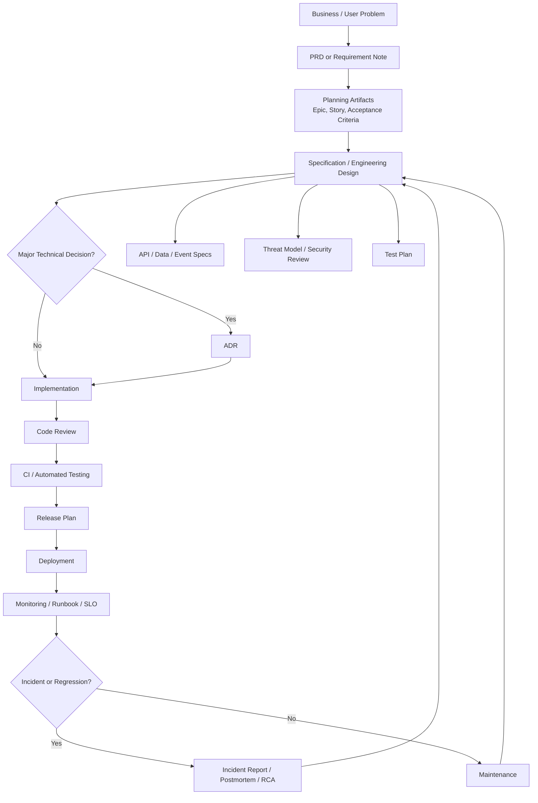
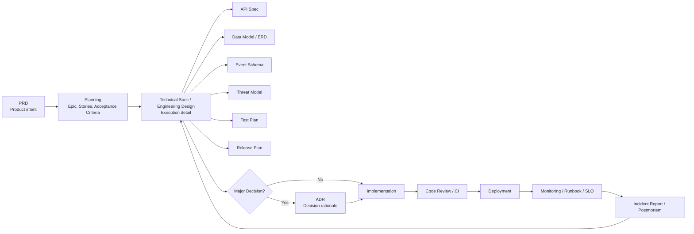

# Software Development Ground Rules

## Overview

This document defines the ground rules for planning, designing, implementing, releasing, operating, and maintaining software.

The goal is not to create documents for their own sake. The goal is to reduce ambiguity, manage engineering risk, improve execution quality, and preserve critical technical knowledge.

The core rule is:

```text
Use the minimum documentation required to make the work clear, testable, reviewable, operable, and maintainable.
```

---

## Core Principles

### 1. Every meaningful change must have clear intent

Before implementation starts, the team must understand:

- What problem is being solved
- Who the users or stakeholders are
- What outcome is expected
- What is explicitly out of scope
- How success will be measured

This intent usually belongs in a **PRD**, lightweight requirement note, epic, or ticket depending on the size of the work.

---

### 2. Every non-trivial change must be specified before it is built

A team should not start implementation when behavior, API contracts, data model, edge cases, or rollout strategy are unclear.

For non-trivial engineering work, the team needs a **Specification**, **Technical Specification**, or **Engineering Design Document**.

In practice, these terms often overlap.

```text
Specification = what must be true
Engineering Design Document = how we will build it
Technical Specification = usually combines both
```

---

### 3. Every significant technical decision must be recorded

If a decision affects architecture, scalability, reliability, security, data model, infrastructure, API compatibility, or long-term maintainability, it should be captured in an **ADR**.

An ADR is not a plan. It is a decision record.

It answers:

```text
What did we decide?
Why did we decide it?
What alternatives did we reject?
What trade-offs did we accept?
```

---

### 4. Every externally visible contract must be explicit

APIs, events, schemas, protocols, permissions, and data contracts must not be implicit in code only.

They should be documented through one or more of:

- API Specification
- OpenAPI / Swagger Spec
- GraphQL Schema
- Event Schema
- Database Schema Document
- Protocol Specification
- Contract Tests

---

### 5. Every release must be testable and reversible

A feature is not ready just because code is merged.

Before release, the team must define:

- Test strategy
- Acceptance criteria
- Rollout plan
- Monitoring signals
- Rollback plan
- Migration safety, if data is involved

---

### 6. Every production system must be operable

A production system must have enough operational documentation for engineers to detect, debug, mitigate, and recover from failures.

At minimum, production-critical systems need:

- Monitoring plan
- Runbook
- Alert definitions
- Ownership information
- Rollback or recovery procedure
- Incident response process

---

### 7. Every sensitive or risky system must include security and privacy review

Security and privacy are design-time concerns, not final-stage checklist items.

Systems involving authentication, authorization, user data, payments, private content, external integrations, or abuse risk should include:

- Threat Model
- Security Review
- Privacy Review
- Access Control Matrix
- Data Retention Policy
- Compliance Checklist, if applicable

---

## Lifecycle Model



---

## Required Artifacts by Lifecycle Stage

| Stage                  | Required Artifacts                             | Optional / Conditional Artifacts                    |
| ---------------------- | ---------------------------------------------- | --------------------------------------------------- |
| Discovery              | PRD, requirement note, success metrics         | Roadmap, user research, market analysis             |
| Planning               | Epic, user stories, tasks, acceptance criteria | Sprint plan, milestone plan                         |
| Design                 | Specification or Engineering Design Document   | RFC, system design doc, low-level design doc        |
| Decision-making        | ADR for major technical decisions              | Decision matrix                                     |
| Contracts              | API spec, data spec, event schema as needed    | OpenAPI, GraphQL schema, protocol spec              |
| Security / Risk        | Threat model for risky systems                 | Privacy review, compliance checklist, risk register |
| Implementation         | Code, code review checklist                    | Branching strategy, implementation checklist        |
| Testing                | Test plan, test cases, regression coverage     | Performance test plan, chaos test plan, UAT         |
| Release                | Release plan, rollout plan, rollback plan      | Migration plan, launch checklist                    |
| Operations             | Runbook, monitoring plan, alerts               | SLO, SLA, error budget, playbook                    |
| Incident / Maintenance | Incident report, postmortem, RCA               | Deprecation plan, disaster recovery plan            |

---

# 1. Product Requirements Document — PRD

## Ground Rule

Use a **PRD** when the team needs alignment on product intent, business value, user needs, scope, or success criteria.

A PRD answers:

```text
What should we build, and why?
```

## Required When

A PRD is required when:

- The work affects user-facing behavior
- Multiple teams or stakeholders are involved
- Product scope is ambiguous
- Success metrics matter
- The feature has business, user, legal, or operational impact

For very small changes, a lightweight requirement note or ticket may be enough.

## Primary Owner

Usually:

- Product Manager
- Product Owner
- Business Owner

Engineering, design, QA, data, security, and operations should review when relevant.

## Required Contents

| Section                 | Purpose                                                    |
| ----------------------- | ---------------------------------------------------------- |
| Problem statement       | Defines the user or business problem                       |
| Background / context    | Explains why this work matters now                         |
| Goals                   | Defines intended outcomes                                  |
| Non-goals               | Explicitly excludes scope                                  |
| Target users            | Identifies affected users or customers                     |
| Use cases               | Describes important user workflows                         |
| Functional requirements | Defines required product behavior                          |
| Success metrics         | Defines how success will be measured                       |
| Constraints             | Captures business, legal, technical, or timing constraints |
| Dependencies            | Lists teams, systems, approvals, or external dependencies  |
| Risks                   | Identifies product, delivery, or adoption risks            |
| Open questions          | Tracks unresolved issues                                   |

## PRD Quality Bar

A good PRD must make it clear:

- Why the work matters
- What outcome is expected
- What is in scope
- What is out of scope
- Who is affected
- How success will be measured
- What constraints engineering must respect

## Anti-Patterns

| Anti-pattern                                 | Problem                                                 |
| -------------------------------------------- | ------------------------------------------------------- |
| PRD contains detailed implementation choices | Couples product intent to premature technical decisions |
| PRD has no non-goals                         | Scope expands uncontrollably                            |
| PRD has no metrics                           | Success cannot be evaluated                             |
| PRD is vague about users                     | Engineering cannot reason about edge cases              |
| PRD is written after implementation          | It becomes documentation theater                        |

---

# 2. Specification / Engineering Design Document

## Ground Rule

Use a **Specification**, **Technical Specification**, or **Engineering Design Document** when the engineering team needs precise behavior, technical design, APIs, data model, rollout strategy, or validation criteria.

This document answers:

```text
How should the system behave, and how will we build it?
```

## Terminology

The word **Specification** is overloaded.

Use the following convention:

| Term                        | Meaning                                                                            |
| --------------------------- | ---------------------------------------------------------------------------------- |
| Functional Specification    | Defines exact user-visible or system behavior                                      |
| Technical Specification     | Defines behavior plus technical design                                             |
| Engineering Design Document | Defines architecture, implementation approach, trade-offs, rollout, and operations |
| System Design Document      | Defines high-level architecture, components, dependencies, and scaling model       |
| Low-Level Design Document   | Defines modules, classes, interfaces, algorithms, and internal structure           |

In day-to-day engineering, **Technical Specification** and **Engineering Design Document** are often the same document.

## Required When

A specification or engineering design document is required when:

- The change affects architecture
- Multiple services or teams are involved
- APIs, schemas, or data migrations are introduced
- There are meaningful reliability, scalability, security, or performance concerns
- The implementation has non-obvious trade-offs
- QA cannot test the behavior directly from the PRD or ticket
- Rollout or rollback requires coordination

## Primary Owner

Usually:

- Engineer
- Tech Lead
- Architect

Product, QA, security, data, and operations should review when relevant.

## Required Contents

| Section                    | Purpose                                                        |
| -------------------------- | -------------------------------------------------------------- |
| Summary                    | Briefly describes the proposed solution                        |
| Requirements               | Links back to PRD, tickets, or user stories                    |
| Non-requirements           | Defines what the design does not solve                         |
| Current state              | Describes existing system behavior                             |
| Proposed design            | Explains the new technical approach                            |
| Architecture diagram       | Shows components and system boundaries                         |
| Data flow                  | Shows how data moves through the system                        |
| API contracts              | Defines endpoints, payloads, errors, and compatibility         |
| Data model                 | Defines tables, indexes, schemas, events, retention            |
| State transitions          | Defines lifecycle states and valid transitions                 |
| Failure handling           | Defines retries, timeouts, fallback, idempotency               |
| Security model             | Defines authentication, authorization, trust boundaries        |
| Performance considerations | Defines latency, throughput, capacity, and scaling assumptions |
| Observability              | Defines logs, metrics, traces, dashboards, alerts              |
| Rollout plan               | Defines feature flags, staged rollout, migration, and rollback |
| Test strategy              | Defines unit, integration, E2E, regression, and load testing   |
| Risks and trade-offs       | Documents known risks and rejected alternatives                |
| Open questions             | Tracks unresolved design issues                                |

## Specification Quality Bar

A good specification should allow engineers and QA to answer:

- What exactly should happen?
- What should never happen?
- What are the edge cases?
- What are the failure modes?
- What are the API and data contracts?
- How will this be tested?
- How will this be rolled out?
- How will this be monitored?
- How will this be rolled back?

## Anti-Patterns

| Anti-pattern                                     | Problem                               |
| ------------------------------------------------ | ------------------------------------- |
| Spec repeats the PRD without technical precision | It does not help implementation       |
| Spec skips failure cases                         | Production behavior becomes undefined |
| Spec omits rollout and rollback                  | Release risk increases                |
| Spec omits observability                         | Failures are hard to detect and debug |
| Spec is too detailed for trivial work            | Slows execution without reducing risk |
| Spec is updated after implementation only        | It stops being a design tool          |

---

# 3. RFC — Request for Comments

## Ground Rule

Use an **RFC** when the team needs feedback on a proposed technical direction before committing to implementation.

An RFC answers:

```text
What technical approach are we proposing, and what feedback do we need?
```

## Required When

Use an RFC when:

- The design affects multiple teams
- There is no obvious best solution
- The decision has long-term architectural impact
- The team needs broad review before implementation
- The design changes platform behavior, infrastructure, or shared contracts

## Difference Between RFC and ADR

| RFC                                 | ADR                                         |
| ----------------------------------- | ------------------------------------------- |
| Used before a decision is finalized | Used after a decision is made               |
| Invites discussion and review       | Records the final decision and rationale    |
| May contain multiple proposals      | Captures one chosen path                    |
| Can be rejected                     | Usually accepted, superseded, or deprecated |

## Required Contents

| Section            | Purpose                             |
| ------------------ | ----------------------------------- |
| Proposal           | Describes the recommended approach  |
| Motivation         | Explains why change is needed       |
| Alternatives       | Lists options under consideration   |
| Trade-offs         | Compares benefits, costs, and risks |
| Compatibility      | Explains impact on existing systems |
| Migration          | Describes transition plan           |
| Feedback requested | Makes review expectations explicit  |
| Decision deadline  | Prevents endless discussion         |

---

# 4. Architecture Decision Record — ADR

## Ground Rule

Use an **ADR** for significant architectural or technical decisions.

An ADR answers:

```text
What decision did we make, why did we make it, and what consequences did we accept?
```

## Required When

An ADR is required when the decision:

- Changes architecture
- Introduces a new infrastructure dependency
- Changes service boundaries
- Selects a database, queue, protocol, framework, or platform
- Affects reliability, scalability, security, or cost
- Has meaningful migration or compatibility impact
- Is likely to be questioned later

## Primary Owner

Usually:

- Engineer
- Tech Lead
- Architect

## Required Contents

| Section                 | Purpose                                            |
| ----------------------- | -------------------------------------------------- |
| Title                   | Short name of the decision                         |
| Status                  | Proposed, accepted, deprecated, superseded         |
| Context                 | Explains the situation and constraints             |
| Decision                | States the chosen option clearly                   |
| Alternatives considered | Lists rejected options                             |
| Rationale               | Explains why this option was selected              |
| Consequences            | Defines benefits, costs, risks, and trade-offs     |
| Follow-ups              | Lists required implementation or migration work    |
| Related documents       | Links to PRD, spec, RFC, tickets, or previous ADRs |

## ADR Quality Bar

A good ADR must be understandable by an engineer who joins the team one year later.

It should explain:

- Why the decision was reasonable at the time
- What constraints shaped the decision
- Which alternatives were rejected
- What risks were knowingly accepted
- When the decision should be revisited

## Anti-Patterns

| Anti-pattern                                    | Problem                                        |
| ----------------------------------------------- | ---------------------------------------------- |
| ADR only states the decision                    | Future readers cannot understand the rationale |
| ADR is written long after the decision          | Context is lost or rewritten inaccurately      |
| ADR is used as a full design document           | It becomes too large and unfocused             |
| ADRs are edited silently after decisions change | Decision history becomes unreliable            |
| Every small choice gets an ADR                  | The decision log becomes noise                 |

---

# 5. API, Data, and Contract Documents

## Ground Rule

All system boundaries must have explicit contracts.

A contract document answers:

```text
How do systems communicate safely and consistently?
```

## Required Documents

| Document                 | Required When                             | Purpose                                                |
| ------------------------ | ----------------------------------------- | ------------------------------------------------------ |
| API Specification        | REST or RPC interface is exposed          | Defines endpoints, requests, responses, errors         |
| OpenAPI / Swagger Spec   | REST APIs need machine-readable contracts | Enables documentation, validation, and code generation |
| GraphQL Schema           | GraphQL API is used                       | Defines queries, mutations, types, and contracts       |
| Event Schema             | Events are published or consumed          | Defines message payloads and compatibility rules       |
| Protocol Specification   | Custom protocol or state machine exists   | Defines wire format and state transitions              |
| Database Schema Document | Data model is non-trivial                 | Defines tables, indexes, constraints, retention        |
| ERD                      | Relational data model is important        | Visualizes entities and relationships                  |
| Migration Plan           | Data or system migration is required      | Defines safe transition and rollback                   |

## Required Contents for API Specs

| Section              | Purpose                                      |
| -------------------- | -------------------------------------------- |
| Endpoint / method    | Defines operation                            |
| Authentication       | Defines access requirements                  |
| Authorization        | Defines permission model                     |
| Request schema       | Defines inputs                               |
| Response schema      | Defines outputs                              |
| Error codes          | Defines failure behavior                     |
| Idempotency          | Defines retry safety                         |
| Rate limits          | Defines abuse and capacity limits            |
| Compatibility policy | Defines versioning and breaking-change rules |

## Required Contents for Event Schemas

| Section             | Purpose                                                 |
| ------------------- | ------------------------------------------------------- |
| Event name          | Defines the event type                                  |
| Producer            | Defines source system                                   |
| Consumers           | Defines dependent systems                               |
| Payload schema      | Defines fields and types                                |
| Ordering guarantees | Defines expected ordering behavior                      |
| Delivery semantics  | At-most-once, at-least-once, exactly-once if applicable |
| Compatibility rules | Defines schema evolution                                |
| Retention           | Defines how long events are retained                    |
| Replay behavior     | Defines whether replay is supported                     |

## Anti-Patterns

| Anti-pattern                                     | Problem                                    |
| ------------------------------------------------ | ------------------------------------------ |
| API behavior is only documented in code          | Consumers depend on implementation details |
| Error behavior is unspecified                    | Clients handle failures inconsistently     |
| Event schemas change without compatibility rules | Downstream consumers break                 |
| Database migration has no rollback plan          | Release risk becomes unacceptable          |
| Permissions are implicit                         | Security bugs become likely                |

---

# 6. Planning and Delivery Artifacts

## Ground Rule

Planning artifacts must convert product and engineering intent into executable work.

They answer:

```text
What work must be done, in what order, and how do we know it is complete?
```

## Common Artifacts

| Artifact            | Purpose                                     |
| ------------------- | ------------------------------------------- |
| Roadmap             | Communicates strategic direction over time  |
| Epic                | Groups a large body of related work         |
| User Story          | Describes user-facing value in a small unit |
| Task / Ticket       | Defines concrete engineering work           |
| Acceptance Criteria | Defines conditions for completion           |
| Definition of Ready | Defines when work is ready to start         |
| Definition of Done  | Defines when work is actually complete      |
| Sprint Plan         | Defines work planned for an iteration       |
| Release Plan        | Defines what will ship and when             |

## Ground Rules

### Roadmap

Use a roadmap for strategic direction, not detailed execution.

A roadmap should communicate:

- Theme
- Business or platform objective
- Rough sequencing
- Major dependencies
- Target timeframe

It should not pretend to be a precise delivery guarantee unless the organization explicitly treats it that way.

### Epic

Use an epic when work needs to be split across multiple stories or tasks.

An epic should include:

- Objective
- Scope
- Links to PRD or spec
- Major milestones
- Dependencies
- Completion criteria

### User Story

Use a user story for user-visible behavior.

A good user story should have:

```text
As a [user],
I want [capability],
so that [benefit].
```

But the format is less important than clarity.

### Acceptance Criteria

Acceptance criteria are mandatory for user-facing work.

They should be:

- Specific
- Testable
- Unambiguous
- Linked to expected behavior
- Clear about edge cases

### Definition of Ready

Work is ready to start when:

- Requirement is clear
- Owner is assigned
- Dependencies are known
- Acceptance criteria exist
- Design questions are resolved or explicitly tracked
- Required reviews are identified

### Definition of Done

Work is done when:

- Code is merged
- Tests pass
- Acceptance criteria are satisfied
- Required documentation is updated
- Monitoring is added if needed
- Rollout and rollback are prepared
- Security/privacy review is complete if required
- Stakeholders are informed if needed

---

# 7. Testing and Quality Documents

## Ground Rule

Every requirement must be testable.

Testing documents answer:

```text
How will we prove the system works correctly and safely?
```

## Required Documents

| Document / Method     | Required When                          | Purpose                                   |
| --------------------- | -------------------------------------- | ----------------------------------------- |
| Test Plan             | Non-trivial feature or system change   | Defines test scope and strategy           |
| Test Cases            | Behavior must be validated             | Defines inputs, actions, expected outputs |
| QA Checklist          | Manual validation is needed            | Ensures repeatable verification           |
| Regression Test Plan  | Existing behavior may break            | Protects against unintended changes       |
| Performance Test Plan | Latency, throughput, or scale matters  | Validates system under load               |
| Chaos Test Plan       | Resilience matters                     | Validates behavior under failure          |
| UAT Plan              | Business/user acceptance is required   | Confirms product expectations             |
| Contract Tests        | Services communicate through contracts | Prevents producer/consumer breakage       |

## Testing Methods

| Method                            | Purpose                                        |
| --------------------------------- | ---------------------------------------------- |
| TDD — Test-Driven Development     | Write tests before implementation              |
| BDD — Behavior-Driven Development | Define behavior in business-readable scenarios |
| Property-Based Testing            | Validate invariants across generated inputs    |
| Contract Testing                  | Verify service compatibility                   |
| Load Testing                      | Validate expected traffic volume               |
| Stress Testing                    | Find breaking points                           |
| Soak Testing                      | Detect long-running degradation                |
| Chaos Testing                     | Validate resilience under controlled failure   |

## Required Test Plan Contents

| Section              | Purpose                                       |
| -------------------- | --------------------------------------------- |
| Scope                | Defines what is tested                        |
| Out of scope         | Defines what is not tested                    |
| Test environments    | Defines where tests run                       |
| Test data            | Defines required data setup                   |
| Test cases           | Defines expected validation                   |
| Automation coverage  | Defines what is automated                     |
| Manual coverage      | Defines what requires human validation        |
| Regression coverage  | Defines existing behavior to protect          |
| Performance criteria | Defines latency, throughput, capacity targets |
| Exit criteria        | Defines when testing is complete              |

## Anti-Patterns

| Anti-pattern                               | Problem                              |
| ------------------------------------------ | ------------------------------------ |
| Tests are derived from implementation only | Bugs in requirements are missed      |
| Edge cases are not tested                  | Production failures increase         |
| Performance is tested after launch         | Capacity risk is discovered too late |
| Manual QA has no checklist                 | Results are inconsistent             |
| No regression coverage                     | Existing behavior breaks silently    |

---

# 8. Security, Privacy, and Risk Documents

## Ground Rule

Security, privacy, and risk must be handled during design, not after implementation.

These documents answer:

```text
What can go wrong, who can be harmed, and how do we reduce that risk?
```

## Required Documents

| Document              | Required When                                                    | Purpose                                         |
| --------------------- | ---------------------------------------------------------------- | ----------------------------------------------- |
| Threat Model          | System has meaningful security risk                              | Identifies attack surfaces and mitigations      |
| Security Review       | Auth, permissions, data, external access, or abuse risk exists   | Validates security controls                     |
| Privacy Review        | User data or sensitive data is processed                         | Validates data handling and privacy obligations |
| Risk Register         | Project has significant delivery, operational, or technical risk | Tracks risks and mitigations                    |
| Compliance Checklist  | Regulated requirements apply                                     | Validates required controls                     |
| Access Control Matrix | Permissions are non-trivial                                      | Defines who can access what                     |
| Data Retention Policy | Data lifecycle matters                                           | Defines retention, deletion, and archival rules |

## Threat Model Required Contents

| Section          | Purpose                                    |
| ---------------- | ------------------------------------------ |
| Assets           | Defines what must be protected             |
| Actors           | Defines users, admins, services, attackers |
| Trust boundaries | Defines where trust changes                |
| Entry points     | Defines where input enters the system      |
| Threats          | Identifies possible attacks or misuse      |
| Mitigations      | Defines controls                           |
| Residual risks   | Captures accepted risks                    |
| Reviewers        | Identifies security approvers              |

## Privacy Review Required Contents

| Section        | Purpose                                     |
| -------------- | ------------------------------------------- |
| Data collected | Defines what data is collected              |
| Purpose        | Defines why data is needed                  |
| Storage        | Defines where data is stored                |
| Retention      | Defines how long data is kept               |
| Access         | Defines who or what can access it           |
| Sharing        | Defines external/internal sharing           |
| Deletion       | Defines deletion behavior                   |
| User controls  | Defines user-visible controls if applicable |

## Anti-Patterns

| Anti-pattern                              | Problem                                         |
| ----------------------------------------- | ----------------------------------------------- |
| Security review happens after code freeze | Fixes become expensive or skipped               |
| Permissions are described informally      | Authorization bugs become likely                |
| Data retention is undefined               | Legal and operational risk increases            |
| Threat model ignores internal actors      | Insider and service-to-service risks are missed |
| Accepted risks are not documented         | Future teams cannot reason about exposure       |

---

# 9. Release, Rollout, and Migration Documents

## Ground Rule

Every release must have a safe path forward and a safe path backward.

Release documents answer:

```text
How will we ship this safely, detect problems, and recover if needed?
```

## Required Documents

| Document         | Required When                                  | Purpose                                      |
| ---------------- | ---------------------------------------------- | -------------------------------------------- |
| Release Plan     | Non-trivial release                            | Defines release scope, timing, and ownership |
| Rollout Plan     | Gradual exposure is needed                     | Defines staged deployment strategy           |
| Rollback Plan    | Production impact is possible                  | Defines how to revert safely                 |
| Migration Plan   | Data, infra, or compatibility migration exists | Defines safe migration sequence              |
| Launch Checklist | Cross-functional launch is needed              | Ensures readiness before release             |
| Changelog        | Users or developers need change visibility     | Summarizes changes                           |

## Required Rollout Plan Contents

| Section            | Purpose                              |
| ------------------ | ------------------------------------ |
| Release owner      | Defines accountable person           |
| Scope              | Defines what is shipping             |
| Feature flags      | Defines runtime controls             |
| Stages             | Defines percentage or cohort rollout |
| Monitoring         | Defines metrics and alerts to watch  |
| Success criteria   | Defines when rollout can proceed     |
| Stop criteria      | Defines when rollout must pause      |
| Rollback procedure | Defines exact recovery steps         |
| Communication plan | Defines who must be informed         |

## Required Migration Plan Contents

| Section                | Purpose                            |
| ---------------------- | ---------------------------------- |
| Current state          | Defines source system or data      |
| Target state           | Defines destination system or data |
| Migration steps        | Defines execution sequence         |
| Compatibility strategy | Defines old/new coexistence        |
| Backfill plan          | Defines historical data migration  |
| Verification           | Defines correctness checks         |
| Rollback               | Defines recovery path              |
| Ownership              | Defines responsible engineers      |
| Timeline               | Defines execution window           |

## Anti-Patterns

| Anti-pattern                      | Problem                                 |
| --------------------------------- | --------------------------------------- |
| Big-bang release with no rollback | Failure impact is maximized             |
| Migration assumes perfect data    | Edge cases break production             |
| Feature flag has no owner         | Dead flags accumulate                   |
| Rollout criteria are vague        | Teams make subjective release decisions |
| Rollback is untested              | Recovery may fail during incident       |

---

# 10. Operations and Reliability Documents

## Ground Rule

If a system runs in production, it must be diagnosable and recoverable.

Operations documents answer:

```text
How do we keep the system healthy, and what do we do when it fails?
```

## Required Documents

| Document               | Required When                                   | Purpose                                      |
| ---------------------- | ----------------------------------------------- | -------------------------------------------- |
| Runbook                | Production system or operational process exists | Gives step-by-step recovery actions          |
| Playbook               | Repeated incident class exists                  | Defines broader response strategy            |
| Monitoring Plan        | Production behavior must be observed            | Defines metrics, logs, traces, dashboards    |
| SLO                    | Reliability target matters                      | Defines measurable reliability objective     |
| SLA                    | External commitment exists                      | Defines contractual service commitment       |
| Error Budget           | SLO-based release/risk management is used       | Defines acceptable failure allowance         |
| Incident Report        | Production incident occurs                      | Records impact, timeline, and mitigation     |
| Postmortem / RCA       | Significant incident occurs                     | Identifies root cause and prevention actions |
| Disaster Recovery Plan | Major outage or data loss risk exists           | Defines recovery strategy                    |

## Required Runbook Contents

| Section          | Purpose                                      |
| ---------------- | -------------------------------------------- |
| Service overview | Explains what the system does                |
| Owners           | Defines responsible team and escalation path |
| Dashboards       | Links to operational visibility              |
| Alerts           | Explains alert meaning and severity          |
| Common failures  | Lists known failure modes                    |
| Diagnosis steps  | Defines investigation procedure              |
| Mitigation steps | Defines immediate recovery actions           |
| Rollback steps   | Defines safe revert procedure                |
| Escalation       | Defines when and whom to contact             |

## Required Monitoring Plan Contents

| Signal           | Examples                                         |
| ---------------- | ------------------------------------------------ |
| Availability     | Success rate, uptime                             |
| Latency          | p50, p95, p99                                    |
| Traffic          | QPS, requests, events                            |
| Errors           | Error rate, exception count                      |
| Saturation       | CPU, memory, queue depth, connection count       |
| Business metrics | Conversion, delivery rate, completion rate       |
| Security signals | Auth failures, abuse patterns, suspicious access |

## SLO Ground Rules

Use SLOs when reliability expectations matter.

A good SLO must define:

- Service indicator
- Target
- Measurement window
- Exclusions
- Alerting threshold
- Error budget policy

Example:

```text
99.9% of notification delivery requests should complete successfully within 5 seconds over a rolling 30-day window.
```

## Postmortem / RCA Ground Rules

A postmortem should be blameless but precise.

It should include:

- What happened
- Customer or business impact
- Timeline
- Root cause
- Detection gap
- Response gap
- What worked
- What failed
- Corrective actions
- Owners and deadlines

## Anti-Patterns

| Anti-pattern                      | Problem                                          |
| --------------------------------- | ------------------------------------------------ |
| Alerts without runbooks           | On-call engineers cannot act quickly             |
| Dashboards without SLOs           | Teams watch metrics without knowing what matters |
| Postmortem has no action items    | Incidents repeat                                 |
| RCA blames individuals            | Systemic causes are ignored                      |
| Disaster recovery is undocumented | Major recovery depends on tribal knowledge       |

---

# 11. Implementation and Code Review Ground Rules

## Ground Rule

Implementation must follow the agreed design, maintain code quality, and preserve system correctness.

Implementation artifacts answer:

```text
How do we safely convert design into maintainable code?
```

## Required Artifacts

| Artifact              | Purpose                                            |
| --------------------- | -------------------------------------------------- |
| Code Review Checklist | Ensures consistent review quality                  |
| CI Pipeline           | Builds, tests, and validates changes automatically |
| Branching Strategy    | Defines how code is integrated                     |
| Coding Standards      | Defines style, structure, and quality expectations |
| Static Analysis Rules | Finds defects and policy violations                |
| Dependency Policy     | Controls third-party dependency risk               |

## Code Review Checklist

A code review should check:

- Correctness
- Simplicity
- Test coverage
- Backward compatibility
- Error handling
- Observability
- Security and permissions
- Performance impact
- Data migration safety
- API/schema compatibility
- Rollback safety
- Documentation updates

## Branching and Delivery Methods

| Method                  | Use Case                               |
| ----------------------- | -------------------------------------- |
| Trunk-Based Development | Frequent small merges into main branch |
| GitFlow                 | Structured release/hotfix branches     |
| Feature Branching       | Isolated work before merge             |
| CI/CD                   | Automated build, test, and deployment  |
| Feature Flags           | Decouple deployment from release       |

## Anti-Patterns

| Anti-pattern                      | Problem                                        |
| --------------------------------- | ---------------------------------------------- |
| Large PRs with no design doc      | Review quality drops                           |
| Code review focuses only on style | Architecture and correctness issues are missed |
| Tests are added only after bugs   | Quality is reactive                            |
| Feature flags are never removed   | Codebase becomes complex                       |
| CI is flaky                       | Engineers lose trust in automation             |

---

# 12. Development Process Methods

## Ground Rule

Development methods are execution frameworks. They do not replace engineering judgment.

Use process to improve flow, feedback, and quality — not to create ceremony.

## Common Methods

| Method                     | Purpose                                                       |
| -------------------------- | ------------------------------------------------------------- |
| Agile                      | Iterative delivery with frequent feedback                     |
| Scrum                      | Sprint-based planning, execution, review, and retrospective   |
| Kanban                     | Flow-based work management with WIP limits                    |
| Waterfall                  | Sequential delivery from requirements to release              |
| V-Model                    | Sequential delivery with explicit verification and validation |
| Lean Software Development  | Reduces waste and improves learning speed                     |
| DevOps                     | Integrates development, deployment, and operations            |
| SRE                        | Applies engineering discipline to reliability and operations  |
| DDD — Domain-Driven Design | Models software around business domains                       |
| Event Storming             | Collaborative domain modeling for event-driven systems        |
| TDD                        | Test-first implementation                                     |
| BDD                        | Behavior-first specification and testing                      |

## Practical Guidance

| Situation                             | Recommended Method              |
| ------------------------------------- | ------------------------------- |
| Requirements are uncertain            | Agile, Scrum, Kanban            |
| Work is operational and continuous    | Kanban                          |
| Reliability is critical               | SRE                             |
| Domain complexity is high             | DDD, Event Storming             |
| API/service compatibility matters     | Contract Testing                |
| Safety-critical or regulated delivery | V-Model or stronger stage gates |
| Fast-moving product feature           | Agile with lightweight specs    |
| Platform or architecture change       | RFC, Technical Spec, ADR        |

---

# 13. Document Selection Rules

## Rule 1: Choose artifacts by risk, not habit

Do not create every document for every change.

Use more documentation when the work has:

- High user impact
- High technical complexity
- High operational risk
- Security or privacy risk
- Data migration
- Multiple teams
- Long-term architectural impact
- External API or compatibility impact

Use less documentation when the change is:

- Small
- Localized
- Reversible
- Low risk
- Well understood
- Covered by existing patterns

---

## Rule 2: Small changes need lightweight documentation

For a small bug fix or simple UI change, a ticket with acceptance criteria and tests may be enough.

Minimum artifacts:

| Artifact            | Required |
| ------------------- | -------- |
| Ticket              | Yes      |
| Acceptance criteria | Yes      |
| Tests               | Usually  |
| PR description      | Yes      |
| ADR                 | No       |
| Full PRD            | No       |
| Full technical spec | No       |

---

## Rule 3: Medium changes need a focused spec

For a feature touching one service or one product workflow, use a lightweight PRD or requirement note plus a focused technical spec.

Minimum artifacts:

| Artifact                | Required                 |
| ----------------------- | ------------------------ |
| PRD or requirement note | Yes                      |
| Technical spec          | Yes                      |
| Acceptance criteria     | Yes                      |
| API/data spec           | If applicable            |
| Test plan               | Yes                      |
| Rollout/rollback plan   | Yes                      |
| ADR                     | If major decision exists |

---

## Rule 4: Large or risky changes need full lifecycle coverage

For large, cross-team, production-critical, security-sensitive, or architecture-heavy work, use full lifecycle documentation.

Minimum artifacts:

| Artifact                                     | Required                        |
| -------------------------------------------- | ------------------------------- |
| PRD                                          | Yes                             |
| Engineering Design Document / Technical Spec | Yes                             |
| RFC                                          | Usually                         |
| ADR                                          | Yes, for major decisions        |
| API/Data/Event Specs                         | If applicable                   |
| Threat Model                                 | If security/privacy risk exists |
| Test Plan                                    | Yes                             |
| Release Plan                                 | Yes                             |
| Rollout/Rollback Plan                        | Yes                             |
| Migration Plan                               | If data/system migration exists |
| Monitoring Plan                              | Yes                             |
| Runbook                                      | Yes                             |
| Postmortem process                           | Yes                             |

---

# 14. Ownership Rules

## Ground Rule

Every artifact must have an owner. Ownerless documents rot.

| Artifact                            | Primary Owner                      | Key Reviewers                   |
| ----------------------------------- | ---------------------------------- | ------------------------------- |
| PRD                                 | PM / Product Owner                 | Engineering, Design, QA, Data   |
| Technical Spec / Engineering Design | Engineer / Tech Lead               | Product, QA, Security, Ops      |
| RFC                                 | Engineer / Tech Lead / Architect   | Affected teams                  |
| ADR                                 | Engineer / Architect / Tech Lead   | Engineering stakeholders        |
| API Spec                            | API owner / Engineer               | Client teams, QA                |
| Data Model / ERD                    | Engineer / Data owner              | DBA, Data, Security             |
| Migration Plan                      | Engineer / Tech Lead               | Ops, Data, QA                   |
| Test Plan                           | QA / Engineer                      | Product, Engineering            |
| Threat Model                        | Engineer / Security                | Security, Privacy, Architecture |
| Release Plan                        | Engineering / Release Owner        | Product, QA, Ops                |
| Runbook                             | Service Owner                      | SRE, On-call engineers          |
| Monitoring Plan                     | Service Owner / SRE                | Engineering, Ops                |
| Incident Report                     | Incident Commander / Service Owner | Affected teams                  |
| Postmortem / RCA                    | Service Owner                      | Engineering, SRE, Product       |

---

# 15. Document Lifecycle Rules

## Rule 1: Documents have states

Use document states to avoid confusion.

Recommended states:

```text
Draft → In Review → Approved → Implemented → Deprecated / Superseded
```

## Rule 2: Approved documents are not silently rewritten

After approval, major changes should be tracked.

Use one of:

- Revision history
- Change log
- New version
- Superseding ADR
- Updated spec with explicit change notes

## Rule 3: ADRs should be superseded, not erased

If a decision changes, create a new ADR or mark the old one as superseded.

Do not rewrite history.

## Rule 4: Specs must match implementation

If implementation changes materially, update the spec.

A stale spec is worse than no spec because it creates false confidence.

## Rule 5: Operational docs must be updated after incidents

If an incident exposes a missing runbook, bad alert, unclear dashboard, or weak rollback plan, update the relevant operational documentation.

---

# 16. Review Gates

## Ground Rule

Do not proceed to the next lifecycle stage if required information is missing.

## Design Review Gate

Before implementation starts, confirm:

- Requirements are clear
- Non-goals are explicit
- Technical approach is reviewed
- API/data contracts are defined
- Risks are understood
- Security/privacy review is triggered if needed
- Test strategy is defined
- Rollout and rollback are plausible
- Open questions are tracked

## Implementation Review Gate

Before merge, confirm:

- Code matches approved design
- Tests are sufficient
- Edge cases are handled
- Observability is added
- Security concerns are addressed
- Backward compatibility is preserved
- Documentation is updated
- Rollback remains possible

## Release Readiness Gate

Before launch, confirm:

- Required tests passed
- Release owner is assigned
- Rollout plan is ready
- Rollback plan is ready
- Monitoring dashboards exist
- Alerts are configured
- Runbook exists for production systems
- Stakeholders are informed
- Known risks are accepted

## Operational Readiness Gate

Before a system becomes production-critical, confirm:

- Ownership is defined
- On-call expectations are clear
- Runbook exists
- SLO or reliability target exists if needed
- Alerts are actionable
- Dashboards are useful
- Disaster recovery is documented if needed

---

# 17. Standard Relationship Between Documents



---

# 18. Recommended Minimum Documentation Matrix

| Change Type                | Minimum Required Documentation                                               |
| -------------------------- | ---------------------------------------------------------------------------- |
| Small bug fix              | Ticket, acceptance criteria, tests, PR description                           |
| Simple UI change           | Requirement note, acceptance criteria, QA checklist                          |
| User-facing feature        | PRD, technical spec, test plan, rollout plan                                 |
| Backend feature            | Technical spec, API/data spec, test plan, monitoring plan                    |
| New API                    | API spec, compatibility policy, contract tests, rollout plan                 |
| Data model change          | Data spec, migration plan, rollback plan, validation plan                    |
| Event-driven change        | Event schema, consumer impact analysis, replay/retention rules               |
| Cross-team platform change | RFC, technical spec, ADR, rollout plan, runbook                              |
| Architecture change        | RFC, technical spec, ADR, migration plan                                     |
| Security-sensitive change  | Threat model, security review, privacy review if needed                      |
| Production-critical system | Technical spec, monitoring plan, SLO, runbook, incident process              |
| Major launch               | PRD, technical spec, test plan, release plan, rollout/rollback plan, runbook |
| Incident follow-up         | Incident report, postmortem/RCA, corrective action plan                      |

---

# 19. Practical Templates

## PRD Template

```markdown
# PRD: [Feature / Product Name]

## Summary

## Problem Statement

## Goals

## Non-Goals

## Target Users

## Use Cases

## Requirements

## Success Metrics

## Constraints

## Dependencies

## Risks

## Open Questions

## Launch Criteria
```

---

## Technical Specification / Engineering Design Template

```markdown
# Technical Specification: [System / Feature Name]

## Summary

## Background

## Requirements

## Non-Requirements

## Current State

## Proposed Design

## Architecture Diagram

## Data Flow

## API Contracts

## Data Model

## State Transitions

## Failure Handling

## Security and Privacy Considerations

## Performance and Scalability

## Observability

## Rollout Plan

## Rollback Plan

## Test Strategy

## Risks and Trade-offs

## Alternatives Considered

## Open Questions
```

---

## ADR Template

```markdown
# ADR: [Decision Title]

## Status

Proposed / Accepted / Deprecated / Superseded

## Context

## Decision

## Alternatives Considered

## Rationale

## Consequences

## Follow-ups

## Related Documents
```

---

## API Specification Template

```markdown
# API Specification: [API Name]

## Overview

## Authentication

## Authorization

## Endpoints

## Request Schema

## Response Schema

## Error Codes

## Rate Limits

## Idempotency

## Versioning

## Compatibility Policy

## Examples

## Tests
```

---

## Test Plan Template

```markdown
# Test Plan: [Feature / System Name]

## Scope

## Out of Scope

## Test Environment

## Test Data

## Test Cases

## Automation Coverage

## Manual QA Coverage

## Regression Coverage

## Performance Testing

## Security Testing

## Exit Criteria

## Risks
```

---

## Release Plan Template

```markdown
# Release Plan: [Release Name]

## Scope

## Release Owner

## Timeline

## Preconditions

## Rollout Strategy

## Feature Flags

## Monitoring

## Success Criteria

## Stop Criteria

## Rollback Plan

## Communication Plan

## Post-Release Validation
```

---

## Runbook Template

```markdown
# Runbook: [Service / System Name]

## Service Overview

## Owners

## Dashboards

## Alerts

## Common Failure Modes

## Diagnosis Steps

## Mitigation Steps

## Rollback Steps

## Escalation Path

## Related Documents
```

---

## Postmortem / RCA Template

```markdown
# Postmortem: [Incident Name]

## Summary

## Impact

## Timeline

## Root Cause

## Detection

## Response

## What Went Well

## What Went Wrong

## Corrective Actions

## Owners and Deadlines

## Follow-up Documents
```

---

# 20. Final Ground Rules

## Non-Negotiable Rules

1. Do not start implementation if the requirement is unclear.
2. Do not introduce a non-trivial technical design without review.
3. Do not make major architectural decisions without recording the rationale.
4. Do not expose APIs, events, or schemas without explicit contracts.
5. Do not release production changes without testing, monitoring, and rollback.
6. Do not process sensitive data without security and privacy review.
7. Do not operate production systems without runbooks and ownership.
8. Do not close incidents without corrective actions.
9. Do not let approved documents silently diverge from implementation.
10. Do not create heavyweight documents when a lightweight artifact is enough.

## Executive Summary

```text
PRD = product intent
Specification / Engineering Design = execution detail
ADR = decision rationale

API/Data/Event Specs = system contracts
Test Plan = validation strategy
Release Plan = safe delivery
Runbook/Monitoring/SLO = production operability
Threat Model/Security Review = risk control
Postmortem/RCA = organizational learning
```

The right documentation strategy is not maximum documentation.

The right strategy is enough documentation to make the work clear, safe, testable, operable, and maintainable.
