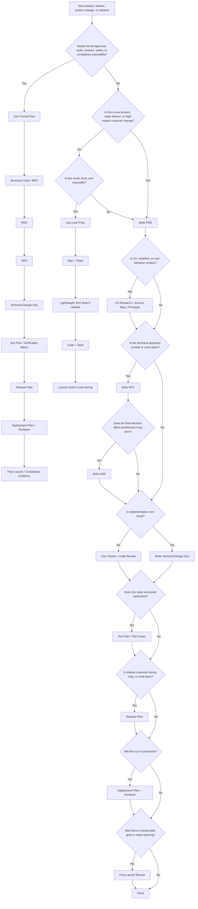

- [Product Documentation Guideline](#product-documentation-guideline)
  - [1. Goal](#1-goal)
  - [2. Core Rule](#2-core-rule)
  - [3. Lifecycle Map](#3-lifecycle-map)
  - [4. Main Documents](#4-main-documents)
  - [5. Choosing the Right Flow](#5-choosing-the-right-flow)
    - [A. Formal / Regulated / Contractual](#a-formal--regulated--contractual)
    - [B. Modern Product Engineering](#b-modern-product-engineering)
    - [C. Lean MVP / Startup](#c-lean-mvp--startup)
    - [D. AI-Augmented Engineering](#d-ai-augmented-engineering)
  - [6. Decision Guide](#6-decision-guide)
  - [7. Document Boundaries](#7-document-boundaries)
  - [8. Practical Rules](#8-practical-rules)
  - [9. AI-Era Documentation Principles](#9-ai-era-documentation-principles)
    - [9.1 What Changed](#91-what-changed)
    - [9.2 Higher-Leverage Documents](#92-higher-leverage-documents)
    - [9.3 Lower-Leverage Documents](#93-lower-leverage-documents)
    - [9.4 What Does Not Change](#94-what-does-not-change)
    - [9.5 Common Anti-Patterns](#95-common-anti-patterns)
    - [9.6 Default Recommendation](#96-default-recommendation)

---

# Product Documentation Guideline

<details>
<summary><h2 style="display: inline">Decision Tree</h2></summary>



</details>

## 1. Goal

Use the smallest set of documents needed to keep product intent, requirements, decisions, implementation, testing, and operations clear.

Do **not** document everything. Document what is durable, risky, cross-functional, regulated, or expensive to reverse. Add formal documents when risk increases. Remove documents when the work is simple, local, and reversible.

---

## 2. Core Rule

Write a document when the work involves:

* unclear scope
* multiple teams
* customer or business impact
* architecture change
* security, privacy, or compliance risk
* formal approval
* production operation
* decisions future teams must understand

Skip documents when a ticket, code review, or short note is enough.

---

## 3. Lifecycle Map

```text
Business Need
  → Product Requirements
  → UX / Design
  → Technical Planning
  → Implementation
  → Testing
  → Release
  → Operation
  → Post-Launch Learning
```

---

## 4. Main Documents

| Document                        | Use it for                                                 | Owner                           |
| ------------------------------- | ---------------------------------------------------------- | ------------------------------- |
| **Business Case / BRD**         | Business reason, funding, ROI, approval                    | Business / Product              |
| **PRD**                         | Product problem, users, scope, goals, acceptance criteria  | PM                              |
| **UX Research / Journey Map**   | User needs, workflows, pain points                         | Design / Research               |
| **Wireframes / Design Spec**    | Screens, flows, interaction states                         | Design                          |
| **SRS**                         | Formal, testable software requirements                     | Product / Systems / Engineering |
| **RFC**                         | Compare technical options before deciding                  | Engineering                     |
| **ADR**                         | Record an accepted architecture decision                   | Engineering / Architecture      |
| **Technical Design Doc**        | Explain how the solution will be built                     | Engineering                     |
| **Agent Operating Manual**      | Repo-scoped instructions for AI agents (e.g., `AGENTS.md`) | Engineering                     |
| **Test Plan / Test Cases**      | Define and prove verification coverage                     | QA / Engineering                |
| **AI Eval / Verification Plan** | Behavioral assertions for AI-generated work                | Engineering / QA                |
| **Release Plan**                | Coordinate launch, rollout, risks, communications          | PM / Release / Engineering      |
| **Deployment Plan**             | Deploy safely and define rollback steps                    | Engineering / SRE               |
| **Runbook**                     | Operate, monitor, troubleshoot, and recover                | Engineering / SRE               |
| **Post-Launch Review**          | Compare outcomes against goals                             | PM                              |
| **Incident Review**             | Capture failure, impact, causes, and fixes                 | Engineering / SRE               |

---

## 5. Choosing the Right Flow

### A. Formal / Regulated / Contractual

Use for medical, financial, government, safety-critical, audited, or client-signoff work.

```text
Business Case / BRD
→ PRD
→ SRS
→ Technical Design
→ Test Plan / Verification Matrix
→ Release Plan
→ Runbook
→ Compliance or Post-Launch Evidence
```

Key requirement: traceability from business need → requirement → design → test → release evidence.

---

### B. Modern Product Engineering

Use for most SaaS, platform, integration, and cross-team product work.

```text
PRD
→ UX / Design Spec
→ RFC if the technical approach is unclear
→ ADR if the decision is durable
→ Technical Design Doc if implementation is non-trivial
→ Test Plan
→ Release Plan
→ Runbook
→ Post-Launch Review
```

Key requirement: separate product intent, technical discussion, final decisions, and implementation detail.

---

### C. Lean MVP / Startup

Use for early-stage, low-risk, fast-changing work.

```text
Lean PRD or Epic
→ Prototype
→ Tickets
→ Lightweight Tech Spec if needed
→ Code
→ Basic Tests
→ Launch Notes
→ Learning Review
```

Key requirement: keep speed, but record decisions that would be painful to rediscover.

---

### D. AI-Augmented Engineering

Use when AI agents perform substantial implementation. Augments Flow B; does not replace it.

```text
PRD with acceptance criteria + anti-requirements
→ ADR for durable decisions
→ Agent Operating Manual (CLAUDE.md / AGENTS.md / .cursorrules)
→ Test Cases as Executable Specification
→ AI-generated Implementation
→ AI Eval / Verification Plan
→ Release Plan
→ Runbook
→ Post-Launch Review
```

Key requirement: tighten upstream specs (atomicity, examples, anti-scope) and reinforce downstream verification (evals, scenario replays).

---

## 6. Decision Guide

| Situation                                     | Write                                                         | Skip                                                |
| --------------------------------------------- | ------------------------------------------------------------- | --------------------------------------------------- |
| New product or major feature                  | PRD                                                           | Starting directly with tickets                      |
| Funding or executive approval needed          | Business Case / BRD                                           | Detailed technical design                           |
| UX is complex or uncertain                    | Research, journey map, prototype                              | Treating wireframes as requirements                 |
| Requirements need formal approval             | SRS                                                           | Informal RFC as the only source of truth            |
| Technical approach is unclear                 | RFC                                                           | Coding before review                                |
| Architecture decision will last               | ADR                                                           | Repeated debate in meetings                         |
| Implementation spans systems                  | Technical Design Doc                                          | Only Jira tickets                                   |
| Standard small feature                        | PRD or epic, tickets, tests                                   | RFC, ADR, SRS                                       |
| Security/privacy/compliance risk              | Security review, SRS or design notes, test evidence           | Late checklist-only review                          |
| Production-critical service                   | Deployment plan, runbook, monitoring notes                    | Tribal operational knowledge                        |
| Major release                                 | Release plan                                                  | Ad hoc launch coordination                          |
| Incident or failed launch                     | Incident review                                               | Untracked fixes                                     |
| AI agents writing substantial code            | Agent Operating Manual + sharpened acceptance criteria + ADRs | Trusting tribal knowledge to survive agent sessions |
| AI-generated work needs verification at scale | AI Eval Plan + executable test cases                          | Manual smoke tests only                             |
| Decisions agents keep re-litigating           | ADR                                                           | Re-explaining context in every prompt               |
| PRD must drive autonomous implementation      | Acceptance criteria + concrete examples + anti-requirements   | Prose-only intent statements                        |

---

## 7. Document Boundaries

| Do not confuse                                     | Difference                                                                                            |
| -------------------------------------------------- | ----------------------------------------------------------------------------------------------------- |
| **BRD vs PRD**                                     | BRD explains business justification. PRD explains product requirements.                               |
| **PRD vs SRS**                                     | PRD defines product outcomes. SRS defines formal, testable software requirements.                     |
| **RFC vs ADR**                                     | RFC helps decide. ADR records what was decided.                                                       |
| **ADR vs Technical Design Doc**                    | ADR captures one decision. Technical design explains implementation.                                  |
| **Wireframes vs Requirements**                     | Wireframes show experience. Requirements define required behavior.                                    |
| **Test Plan vs Test Cases**                        | Test plan defines strategy. Test cases verify specific behavior.                                      |
| **Agent Operating Manual vs Technical Design Doc** | Agent Operating Manual = repo-scoped conventions for agents. Tech Design = how this feature is built. |
| **AI Eval Plan vs Test Plan**                      | Test Plan = deterministic behavior. AI Eval Plan = behavioral assertions across scenarios.            |
| **Acceptance Criteria vs SRS**                     | AC = testable scenarios inside a PRD. SRS = formal shall-statements with traceability matrix.         |

---

## 8. Practical Rules

1. **Use PRD as the default product document.**
2. **Use SRS only when formal requirements and traceability matter.**
3. **Use RFC only when the technical approach needs review.**
4. **Use ADR only for decisions worth remembering.**
5. **Use Technical Design Docs for non-trivial implementation.**
6. **Use Runbooks for anything production-critical.**
7. **Do not use “TDD” for Technical Design Document unless your team has standardized it. TDD usually means Test-Driven Development.**
8. **Prefer links over duplicated content.**
9. **Assign one owner per document.**
10. **Archive or supersede old documents; do not silently rewrite history.**
11. **Write acceptance criteria as concrete examples or executable scenarios.**
12. **List anti-requirements (explicitly NOT in scope) as a first-class section in the PRD.**
13. **Maintain an Agent Operating Manual** (`CLAUDE.md`, `AGENTS.md`, `.cursorrules`) **at the repo root when AI agents operate in the codebase.**
14. **Define an AI Eval Plan for non-trivial AI-generated work.**
15. **Record durable decisions in ADRs, even within a single team.**

---

## 9. AI-Era Documentation Principles

### 9.1 What Changed

| Cost vector         | Pre-AI                                  | Post-AI                                                          |
| ------------------- | --------------------------------------- | ---------------------------------------------------------------- |
| Implementation      | Slow; vagueness was forgiving           | Fast; vagueness becomes confidently-wrong artifacts              |
| Iteration / rework  | Expensive; favored heavy upfront design | Cheap; favors empirical iteration with crisp acceptance criteria |
| Tribal knowledge    | Survived via human onboarding           | Invisible to agents; must be externalized                        |
| Code review         | Reviewers could line-read small PRs     | Reviewers cannot line-read large agent PRs; evals required       |
| Decision durability | Watercooler memory often sufficed       | Agents re-litigate every undocumented decision                   |

### 9.2 Higher-Leverage Documents

* Agent Operating Manual
* PRD acceptance criteria with concrete examples
* ADRs
* Test cases as executable specification
* AI Eval / Verification Plan

### 9.3 Lower-Leverage Documents

* Long-form prose specifications
* Status / activity reports
* Heavyweight SRS without compliance pressure

### 9.4 What Does Not Change

* Business case, release plan, runbook, incident review.
* Empirical iteration beats prediction.
* Document boundaries (PRD ≠ SRS ≠ Tech Design).

### 9.5 Common Anti-Patterns

* Adopting SRS to solve AI ambiguity. SRS solves audit traceability.
* Treating long Markdown as agent context. Length is not rigor.
* Skipping the Agent Operating Manual when AI agents operate in the codebase.
* Merging AI-generated code without an eval plan when unit tests pass.
* Mixing agent operating instructions into the PRD.

### 9.6 Default Recommendation

```text
PRD with acceptance criteria + anti-requirements
→ ADR for durable decisions
→ Agent Operating Manual at the repo root
→ Technical Design Doc if implementation is non-trivial
→ Test Cases as executable specification
→ AI Eval Plan if AI generates substantial code
→ Release Plan + Runbook for production-critical work
→ Post-Launch Review when measurable goals exist
```

Skip SRS unless audit, compliance, or contractual signoff requires it.
