# Product Cycle — Documentation System

The smallest set of documents that keeps product intent, requirements, decisions, implementation, testing, and operations clear — **repriced for AI-driven software development.**

This root file is the **index, glossary, and decision framework**. Each lifecycle phase has its own file under [`cycle/`](cycle/) with the full, boundary-defined spec for every document type. The reference catalog is complete; the governance here tells you *which* documents to actually use.

> **Do not document everything.** Document what is durable, risky, cross-functional, regulated, or expensive to reverse. Add formal documents as risk increases; drop them when work is simple, local, and reversible. The rationale for every verdict lives in [AI-Era Principles](cycle/ai-era-principles.md).

---

## Contents

- [1. Goal & Core Rule](#1-goal--core-rule)
- [2. How to use this system](#2-how-to-use-this-system)
- [3. Index — the lifecycle phases](#3-index--the-lifecycle-phases)
- [4. Lifecycle map](#4-lifecycle-map)
- [5. Decision tree](#5-decision-tree)
- [6. Choosing the right flow](#6-choosing-the-right-flow)
- [7. Decision guide & risk tiers](#7-decision-guide--risk-tiers)
- [8. Document glossary](#8-document-glossary)
- [9. Concept & acronym glossary](#9-concept--acronym-glossary)
- [10. Document boundaries](#10-document-boundaries)
- [11. Practical rules](#11-practical-rules)

---

## 1. Goal & Core Rule

Write a document when the work involves: unclear scope · multiple teams · customer or business impact · architecture change · security/privacy/compliance risk · formal approval · production operation · decisions future teams (or agents) must understand.

Skip the document when a ticket, code review, executable artifact, or short note is enough.

**Badge legend** (used in every phase file):

| Badge | Meaning |
|---|---|
| `Core` | Standard default for non-trivial work |
| `Elevated` | Higher-leverage in AI-driven workflows |
| `Conditional` | Only when a specific trigger fires (compliance, scale, external contract, events…) |
| `Executable` | Prefer the machine-readable form; prose points to it |
| `Merged` | Synonym or folded into another document — don't maintain separately |
| `AI-native` | New document the traditional catalog lacks |

---

## 2. How to use this system

1. Start from **intent** ([PRD](cycle/01-product-and-ux.md)) and the **risk tier** (§7).
2. Pull only the documents the [decision tree](#5-decision-tree) and [decision guide](#7-decision-guide--risk-tiers) call for.
3. For each document you do write, open its phase file and follow the spec: `Answers · Use when · Skip when · Owner · Key contents · Boundary · In AI-driven workflows`.
4. When agents operate in the repo, the [Agent Operating Manual](cycle/07-implementation-and-execution.md) and [Autonomy & Approval Policy](cycle/12-autonomy-and-approval.md) are not optional.
5. Read [AI-Era Principles](cycle/ai-era-principles.md) once to understand the five reframes (P1–P5) behind every verdict.

---

## 3. Index — the lifecycle phases

| # | Phase | Documents covered |
|---|---|---|
| [01](cycle/01-product-and-ux.md) | **Product & UX** | PRD · Business Case/BRD · UX/Design Spec · Success Metrics · Analytics Spec · Experiment Design |
| [02](cycle/02-requirements.md) | **Requirements** | SRS · Non-Functional Requirements |
| [03](cycle/03-architecture-and-design.md) | **Architecture & Design** | Architecture Design Doc · Technical Design Doc · Technical Specification · RFC · ADR |
| [04](cycle/04-interfaces-and-data.md) | **Interfaces & Data** | API Spec · Data Model/Schema · Event Spec · Integration Spec |
| [05](cycle/05-security-privacy-compliance.md) | **Security, Privacy & Compliance** | Threat Model · Security Review · Privacy Review · Compliance Doc |
| [06](cycle/06-reliability-and-scale.md) | **Reliability & Scale** | SLO/SLA/Error Budget · Capacity Plan · Performance Design · DR/BCP |
| [07](cycle/07-implementation-and-execution.md) | **Implementation & Execution** | Engineering Plan · Task Breakdown · Code/Repo Guide · Dev Env Setup · Agent Operating Manual |
| [08](cycle/08-testing-and-quality.md) | **Testing & Quality** | Test Strategy · QA/Acceptance Plan · Load Test Report · AI Eval/Verification Plan |
| [09](cycle/09-release-and-rollout.md) | **Release & Rollout** | Launch Plan · Rollout/Migration Plan · Rollback Plan · Release Notes · Deprecation Plan |
| [10](cycle/10-operations-and-observability.md) | **Operations & Observability** | Observability Spec · Runbook · Incident Playbook · Operational Readiness · Support Guide · Agent Audit Trail |
| [11](cycle/11-governance-and-learning.md) | **Governance & Learning** | Ownership/RACI · Dependency Map · Postmortem · Retrospective |
| [12](cycle/12-autonomy-and-approval.md) | **Autonomy & Approval** | Autonomy & Approval Policy |
| [✦](cycle/ai-era-principles.md) | **AI-Era Principles** | The five reframes, what changed, anti-patterns, default flow |

---

## 4. Lifecycle map

```text
Business Need
  → Product Requirements
  → UX / Design
  → Technical Planning
  → Implementation
  → Testing
  → Release
  → Operation
  → Post-Launch Learning
```

---

## 5. Decision tree

```mermaid
flowchart TD
    A["New product, feature, system change, or initiative"] --> B{"Needs formal approval, audit, contract, safety, or compliance traceability?"}

    B -->|Yes| C["Use Formal Flow"]
    C --> C1["Business Case / BRD"]
    C1 --> C2["PRD"]
    C2 --> C3["SRS"]
    C3 --> C4["Technical Design Doc"]
    C4 --> C5["Test Plan / Verification Matrix"]
    C5 --> C6["Release Plan"]
    C6 --> C7["Deployment / Rollout + Runbook"]
    C7 --> C8["Post-Launch / Compliance Evidence"]

    B -->|No| D{"New product, major feature, or high-impact customer change?"}

    D -->|Yes| E["Write PRD (acceptance criteria + anti-requirements)"]
    D -->|No| F{"Small, local, and reversible?"}

    F -->|Yes| G["Use Lean Flow"]
    G --> G1["Epic / Ticket"]
    G1 --> G2["Lightweight Tech Note if needed"]
    G2 --> G3["Code + Executable Tests"]
    G3 --> G4["Launch Notes if user-facing"]

    F -->|No| E

    E --> AOM{"Do AI agents operate in the repo?"}
    AOM -->|Yes| AOM1["Agent Operating Manual + Autonomy & Approval Policy"]
    AOM1 --> H{"Is UX, workflow, or user behavior unclear?"}
    AOM -->|No| H
    H -->|Yes| H1["UX Research / Journey Map / Prototype"]
    H -->|No| I{"Technical approach unclear or cross-team?"}
    H1 --> I

    I -->|Yes| J["Write RFC (or spike + compare)"]
    J --> K{"Does the decision affect architecture long-term?"}
    I -->|No| L{"Implementation non-trivial?"}

    K -->|Yes| K1["Write ADR"]
    K -->|No| L
    K1 --> L

    L -->|Yes| L1["Technical Design Doc + executable contracts"]
    L -->|No| M["Tickets + Code Review"]
    L1 --> N{"Needs structured verification?"}
    M --> N

    N -->|Yes| N1["Test Cases + AI Eval Plan (if agents generate code)"]
    N -->|No| O{"Release customer-facing, risky, or multi-team?"}
    N1 --> O

    O -->|Yes| O1["Launch + Progressive Rollout + tested Rollback"]
    O -->|No| P{"Will this run in production?"}
    O1 --> P

    P -->|Yes| P1["Observability Spec + Runbook + Operational Readiness"]
    P -->|No| Q{"Measurable goal or major learning?"}
    P1 --> Q

    Q -->|Yes| Q1["Postmortem (incidents) → Retrospective (periodic)"]
    Q -->|No| R["Done"]
    Q1 --> R
```

<details>
<summary><b>Which documents does this change need?</b></summary>



</details>

---

## 6. Choosing the right flow

### A. Formal / Regulated / Contractual
Medical, financial, government, safety-critical, audited, or client-signoff work.
```text
Business Case / BRD → PRD → SRS → Technical Design
→ Test Plan / Verification Matrix → Release Plan → Runbook → Compliance / Post-Launch Evidence
```
Key requirement: traceability from business need → requirement → design → test → release evidence.

### B. Modern Product Engineering
Most SaaS, platform, integration, and cross-team product work.
```text
PRD → UX/Design Spec → RFC (if approach unclear) → ADR (if durable)
→ Technical Design (if non-trivial) → Test Plan → Release/Rollout → Runbook → Post-Launch Review
```
Key requirement: separate product intent, technical discussion, final decisions, and implementation detail.

### C. Lean MVP / Startup
Early-stage, low-risk, fast-changing work.
```text
Lean PRD or Epic → Prototype → Tickets → Lightweight Tech Note (if needed)
→ Code → Basic Tests → Launch Notes → Learning Review
```
Key requirement: keep speed, but record decisions that would be painful to rediscover.

### D. AI-Augmented Engineering
When agents perform substantial implementation. **Augments Flow B; does not replace it.** See the full version in [AI-Era Principles](cycle/ai-era-principles.md#ai-augmented-default-flow).
```text
PRD (acceptance criteria + anti-requirements) → ADR → Agent Operating Manual
→ Autonomy & Approval Policy → Technical Design (if non-trivial) → executable contracts
→ agent-executable task plan → executable test cases → AI Eval Plan
→ progressive Rollout + tested Rollback → Observability + Runbook → Postmortem → Retrospective
```
Key requirement: tighten upstream specs (atomicity, examples, anti-scope) and reinforce downstream verification (evals, scenario replays, progressive rollout).

---

## 7. Decision guide & risk tiers

### When to write / skip

| Situation | Write | Skip |
|---|---|---|
| New product or major feature | PRD | Starting directly with tickets |
| Funding/executive approval needed | Business Case / BRD | Detailed technical design |
| UX complex or uncertain | Research, journey map, prototype | Treating wireframes as requirements |
| Requirements need formal approval | SRS | Informal RFC as the only source of truth |
| Technical approach unclear | RFC, or spike + compare | Coding before review |
| Architecture decision will last | ADR | Repeated debate in meetings |
| Implementation spans systems | Technical Design Doc | Only Jira tickets |
| Standard small feature | PRD/epic + tickets + tests | RFC, ADR, SRS |
| Security/privacy/compliance risk | Threat Model + review + test evidence | Late checklist-only review |
| Production-critical service | Observability + Runbook + Operational Readiness | Tribal operational knowledge |
| Major release | Launch + Rollout + Rollback | Ad hoc launch coordination |
| Incident | Postmortem (async, technical) | Untracked fixes |
| **AI agents writing substantial code** | **Agent Operating Manual + sharpened acceptance criteria + ADRs** | Trusting tribal knowledge to survive agent sessions |
| **AI-generated work needs verification** | **AI Eval Plan + executable test cases** | Manual smoke tests only |
| **Agents take actions in prod paths** | **Autonomy & Approval Policy + audit trail** | Unbounded agent autonomy |
| Decisions agents keep re-litigating | ADR | Re-explaining context every prompt |
| PRD must drive autonomous implementation | Acceptance criteria + examples + anti-requirements | Prose-only intent statements |

### Minimum set by risk tier

| Tier | Work | Minimum documents |
|---|---|---|
| **Small** | local, reversible, low-risk | Ticket + acceptance criteria + executable tests *(+ Agent Operating Manual if agents)* |
| **Medium** | one service or workflow | PRD/epic + Technical Design + executable contracts + Test/Eval + Rollout/Rollback + ADR for any real decision |
| **Large** | cross-team, production-critical, architecture-heavy | Above + Architecture Doc + RFC + Threat Model + SLO + Capacity + Observability + Runbook + Operational Readiness + Launch Plan + Dependency Map + Postmortem *(SRS/Compliance only if regulated)* |

---

## 8. Document glossary

Every document type, one line, with its badge and full spec. Grouped by phase.

| Document | One line | Badge | Spec |
|---|---|---|---|
| PRD | Why we're building this and what behavior we want | `Core` `Elevated` | [01](cycle/01-product-and-ux.md) |
| Business Case / BRD | Whether it's worth funding, and why | `Conditional` | [01](cycle/01-product-and-ux.md) |
| UX / Design Spec | Detailed user-facing behavior | `Core` `Conditional` | [01](cycle/01-product-and-ux.md) |
| Success Metrics | How we'll know it worked | `Core` | [01](cycle/01-product-and-ux.md) |
| Analytics / Metrics Spec | What we log and how | `Elevated` `Executable` | [01](cycle/01-product-and-ux.md) |
| Experiment Design | Whether the change causally moves the metric | `Elevated` | [01](cycle/01-product-and-ux.md) |
| SRS | Formal, testable, traceable requirements | `Conditional` | [02](cycle/02-requirements.md) |
| Non-Functional Requirements | Speed/availability/scale targets | `Merged` → SLO/capacity/AC | [02](cycle/02-requirements.md) |
| Architecture Design Doc | System shape, boundaries, failure domains | `Core` `Elevated` | [03](cycle/03-architecture-and-design.md) |
| Technical Design Doc | How this feature/subsystem is built | `Core` | [03](cycle/03-architecture-and-design.md) |
| Technical Specification | Synonym for Technical Design Doc | `Merged` | [03](cycle/03-architecture-and-design.md) |
| RFC | Proposed direction needing feedback before commit | `Conditional` | [03](cycle/03-architecture-and-design.md) |
| ADR | A decision, its rationale, and rejected alternatives | `Core` `Elevated` | [03](cycle/03-architecture-and-design.md) |
| API Specification | The contract for an interface | `Core` `Executable` | [04](cycle/04-interfaces-and-data.md) |
| Data Model / Schema | How data is stored, indexed, governed | `Core` `Executable` | [04](cycle/04-interfaces-and-data.md) |
| Event / Messaging Spec | Async producer/consumer contracts | `Conditional` `Executable` | [04](cycle/04-interfaces-and-data.md) |
| Integration Spec | How we consume a dependency safely | `Conditional` `Merged` | [04](cycle/04-interfaces-and-data.md) |
| Threat Model | How the system can be attacked or abused | `Elevated` | [05](cycle/05-security-privacy-compliance.md) |
| Security Review | Whether controls are adequate and approved | `Core` `Conditional` | [05](cycle/05-security-privacy-compliance.md) |
| Privacy / Data Protection Review | Lawful, safe handling of personal data | `Conditional` | [05](cycle/05-security-privacy-compliance.md) |
| Compliance Document | System behavior mapped to regulations | `Conditional` | [05](cycle/05-security-privacy-compliance.md) |
| SLO / SLA / Error Budget | Reliability targets and consequences | `Elevated` `Executable` | [06](cycle/06-reliability-and-scale.md) |
| Capacity Planning | Whether it handles expected scale | `Conditional` | [06](cycle/06-reliability-and-scale.md) |
| Performance Design | Whether the critical path meets its latency budget | `Merged` | [06](cycle/06-reliability-and-scale.md) |
| Disaster Recovery / BCP | Recovery from catastrophic failure | `Conditional` | [06](cycle/06-reliability-and-scale.md) |
| Engineering / Execution Plan | What work, in what order, by whom | `Conditional` | [07](cycle/07-implementation-and-execution.md) |
| Task Breakdown / Implementation Plan | Concrete, verifiable units of work | `Elevated` `Executable` | [07](cycle/07-implementation-and-execution.md) |
| Code Structure / Repo Guide | Repo layout and conventions | `Merged` → Agent Manual | [07](cycle/07-implementation-and-execution.md) |
| Development Environment Setup | How to get a working environment | `Conditional` `Executable` | [07](cycle/07-implementation-and-execution.md) |
| Agent Operating Manual | How agents behave in this repo | `AI-native` `Elevated` | [07](cycle/07-implementation-and-execution.md) |
| Test Strategy | Overall testing approach | `Core` | [08](cycle/08-testing-and-quality.md) |
| QA / Acceptance Test Plan | Verifying acceptance criteria | `Core` `Executable` | [08](cycle/08-testing-and-quality.md) |
| Load Test / Benchmark Report | Whether capacity assumptions held | `Conditional` | [08](cycle/08-testing-and-quality.md) |
| AI Eval / Verification Plan | Behavioral assurance for AI output | `AI-native` `Elevated` | [08](cycle/08-testing-and-quality.md) |
| Launch Plan | How it goes live (coordination & comms) | `Core` | [09](cycle/09-release-and-rollout.md) |
| Rollout / Migration Plan | Progressive exposure and data migration | `Elevated` | [09](cycle/09-release-and-rollout.md) |
| Rollback Plan | Fast return to a known-good state | `Elevated` | [09](cycle/09-release-and-rollout.md) |
| Release Notes | What changed, for whom | `Core` `Executable` | [09](cycle/09-release-and-rollout.md) |
| Deprecation Plan | Removing surface without breaking consumers | `Conditional` | [09](cycle/09-release-and-rollout.md) |
| Observability Specification | How we detect and debug problems | `Elevated` | [10](cycle/10-operations-and-observability.md) |
| Runbook | What on-call does for a known situation | `Elevated` `Executable` | [10](cycle/10-operations-and-observability.md) |
| Incident Response Playbook | How we run any incident | `Core` | [10](cycle/10-operations-and-observability.md) |
| Operational Readiness Review | Launch gate: is it operable? | `Core` | [10](cycle/10-operations-and-observability.md) |
| Customer Support / Ops Guide | Helping users and operators | `Conditional` | [10](cycle/10-operations-and-observability.md) |
| Agent Action Audit / Provenance Trail | What agents did, reconstructable | `AI-native` | [10](cycle/10-operations-and-observability.md) |
| Ownership / RACI | Who owns, approves, is informed | `Core` | [11](cycle/11-governance-and-learning.md) |
| Dependency Map | Upstream/downstream inventory | `Elevated` | [11](cycle/11-governance-and-learning.md) |
| Postmortem | Async technical analysis of an incident | `Elevated` | [11](cycle/11-governance-and-learning.md) |
| Retrospective | Periodic human/process review of postmortems | `Core` | [11](cycle/11-governance-and-learning.md) |
| Autonomy & Approval Policy | What agents may do, and who approves the rest | `AI-native` | [12](cycle/12-autonomy-and-approval.md) |

---

## 9. Concept & acronym glossary

| Term | Definition |
|---|---|
| **Acceptance criteria** | Testable, example-driven conditions for "done", inside a PRD |
| **Anti-requirements** | What is explicitly **not** in scope, as a first-class PRD section |
| **ADR** | Architecture Decision Record — one decision, its rationale, rejected alternatives |
| **RFC** | Request for Comments — a proposed direction seeking feedback before commit |
| **PRD / BRD / SRS** | Product Requirements / Business Requirements / Software Requirements Specification |
| **SLI / SLO / SLA** | Measured indicator / internal target / external commitment |
| **Error budget** | Allowed unreliability before release/risk policy changes |
| **RTO / RPO** | Recovery Time Objective / Recovery Point Objective (max downtime / max data loss) |
| **Golden signals** | Latency, traffic, errors, saturation |
| **Blast radius** | The scope of impact if an action or failure goes wrong |
| **Canary / progressive rollout** | Exposing a change to a small slice before full release |
| **Feature flag** | Runtime switch that decouples deploy from release |
| **Backfill** | Populating historical data after a schema/feature change |
| **DLQ** | Dead-letter queue — where undeliverable messages go |
| **Idempotency** | Safe to retry: repeating an operation yields the same result |
| **Contract test** | Verifies producer/consumer stay compatible with a contract |
| **SAST / DAST** | Static / Dynamic Application Security Testing |
| **Prompt injection** | Untrusted input manipulating an agent's instructions |
| **Eval** | A behavioral assertion suite for non-deterministic AI output |
| **A0–A3 autonomy** | Observe → auto-execute reversible → human-approval → forbidden (see [12](cycle/12-autonomy-and-approval.md)) |
| **Agent Operating Manual** | Repo-scoped instructions for agents (`CLAUDE.md`, `AGENTS.md`, `.cursorrules`) |
| **RACI** | Responsible, Accountable, Consulted, Informed |
| **Dogfood / GA** | Internal use of your own product / General Availability |

---

## 10. Document boundaries

The pairs people confuse most:

| Don't confuse | Difference |
|---|---|
| **BRD vs PRD** | BRD = business justification. PRD = product requirements. |
| **PRD vs SRS** | PRD = product outcomes. SRS = formal, testable, traceable shall-statements. |
| **Acceptance Criteria vs SRS** | AC = testable scenarios inside a PRD. SRS = formal statements with a traceability matrix. |
| **RFC vs ADR** | RFC helps decide. ADR records what was decided. |
| **ADR vs Technical Design** | ADR = one decision's rationale. Tech Design = the whole implementation. |
| **Architecture Doc vs Technical Design** | Architecture = system shape (broad, durable). Tech Design = this feature (narrow). |
| **Wireframes vs Requirements** | Wireframes show experience. Requirements define required behavior. |
| **Test Plan vs Test Cases** | Test Plan = strategy. Test Cases = specific behavior. |
| **Test Plan vs AI Eval Plan** | Test Plan = deterministic behavior. AI Eval Plan = behavioral assertions across scenarios. |
| **Experiment vs AI Eval** | Experiment = causal product impact. Eval = correctness of AI behavior. |
| **SLO vs Success Metrics** | SLO = reliability target. Success Metrics = product outcome target. |
| **Capacity vs Performance** | Capacity = throughput at scale. Performance = latency of the critical path. |
| **Runbook vs Incident Playbook** | Runbook = service-specific actions. Playbook = process for any incident. |
| **Runbook vs DR Plan** | Runbook = routine recovery. DR = catastrophic recovery. |
| **Agent Operating Manual vs Technical Design** | Manual = repo-scoped agent conventions. Tech Design = how a feature is built. |
| **Agent Operating Manual vs Autonomy Policy** | Manual = *how* agents work. Policy = *what* they may do without approval. |
| **Postmortem vs Retrospective** | Postmortem = system/technical, immediate, async. Retrospective = people/process, periodic, synchronous, reviews postmortems. |
| **Rollout vs Rollback** | Rollout = forward exposure. Rollback = reverse path. |
| **Rollout vs Deprecation** | Rollout = introducing. Deprecation = removing. |

---

## 11. Practical rules

1. **Use the PRD as the default product document.** Write acceptance criteria as concrete examples; list anti-requirements as a first-class section.
2. **Prefer executable artifacts over prose** (OpenAPI, migrations, test-as-spec, SLO-as-config, runbook-as-YAML). The doc points to the source of truth.
3. **Bias to spike-then-thin-design** for reversible work; reserve heavy design for irreversible/high-blast-radius/cross-team work.
4. **Record durable decisions in ADRs** — even within a single team. Supersede; don't silently rewrite.
5. **Use SRS only when audit, compliance, or contract requires traceability.** It does not solve AI ambiguity — acceptance criteria + evals do.
6. **Maintain an Agent Operating Manual** at the repo root whenever agents operate in the codebase.
7. **Define an Autonomy & Approval Policy and audit trail** before agents take actions in production paths.
8. **Define an AI Eval Plan** for non-trivial AI-generated or AI-powered work; passing unit tests is not enough to merge un-line-readable PRs.
9. **Make rollout progressive and rollback tested** — they are the safety net for fast, less-scrutinized delivery.
10. **Every production system needs Observability + Runbook + Operational Readiness.**
11. **Don't confuse "TDD"**: here it means Technical Design Document, not Test-Driven Development.
12. **Prefer links over duplicated content.** Assign one owner per document. Archive or supersede — don't rewrite history.
13. **Every document needs an owner who verifies it.** Never auto-generate-and-forget — generated documentation theater is a real AI-era failure mode.

---

*Rationale for every verdict: [AI-Era Principles](cycle/ai-era-principles.md).*
