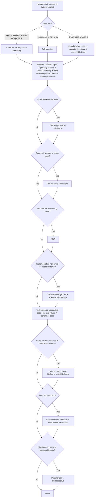

# Product Cycle — Documentation System

The smallest set of documents that keeps product intent, requirements, decisions, implementation, testing, and operations clear in AI-driven software development.

This root file is the **index, glossary, and decision framework**. Each lifecycle phase has its own file under [`cycle/`](cycle/) with the full, boundary-defined spec for every document type. The catalog is complete; the governance here tells you *which* documents to actually use.

> **Do not document everything.** Document what is durable, risky, cross-functional, regulated, or expensive to reverse. Add formal documents as risk increases; drop them when work is simple, local, and reversible. The rationale for every verdict lives in [AI-Era Principles](cycle/ai-era-principles.md).

---

## Contents

- [1. Goal & core rule](#1-goal--core-rule)
- [2. How to use this system](#2-how-to-use-this-system)
- [3. Index — the lifecycle phases](#3-index--the-lifecycle-phases)
- [4. Decision tree](#4-decision-tree)
- [5. Decision guide & risk tiers](#5-decision-guide--risk-tiers)
- [6. Document catalog](#6-document-catalog)
- [7. Concept & acronym glossary](#7-concept--acronym-glossary)
- [8. Document boundaries](#8-document-boundaries)
- [9. Practical rules](#9-practical-rules)

---

## 1. Goal & core rule

Write a document when the work involves: unclear scope · multiple teams · customer or business impact · architecture change · security/privacy/compliance risk · formal approval · production operation · decisions future teams or agents must understand.

Skip the document when a ticket, code review, executable artifact, or short note is enough.

---

## 2. How to use this system

The lifecycle runs: business need → product requirements → UX → technical planning → implementation → testing → release → operation → post-launch learning. Phases 01–12 below map to it.

1. Start from **intent** ([PRD](cycle/01-product-and-ux.md)) and the **risk tier** ([§5](#5-decision-guide--risk-tiers)).
2. Pull only the documents the [decision tree](#4-decision-tree) and [risk tiers](#5-decision-guide--risk-tiers) call for.
3. For each document you write, open its phase file and follow the spec: `Answers · Use when · Skip when · Owner · Key contents · Boundary · Why it matters`.
4. The [Agent Operating Manual](cycle/07-implementation-and-execution.md) and [Autonomy & Approval Policy](cycle/12-autonomy-and-approval.md) are baseline, not optional — agents operate in the repo by default.
5. Read [AI-Era Principles](cycle/ai-era-principles.md) once to understand the five principles (P1–P5) behind every verdict.

---

## 3. Index — the lifecycle phases

| # | Phase | Documents covered |
|---|---|---|
| [01](cycle/01-product-and-ux.md) | **Product & UX** | PRD · Business Case/BRD · UX/Design Spec · Success Metrics · Analytics Spec · Experiment Design |
| [02](cycle/02-requirements.md) | **Requirements** | SRS |
| [03](cycle/03-architecture-and-design.md) | **Architecture & Design** | Architecture Design Doc · Technical Design Doc · RFC · ADR |
| [04](cycle/04-interfaces-and-data.md) | **Interfaces & Data** | API Spec · Data Model/Schema · Event Spec · Integration Spec |
| [05](cycle/05-security-privacy-compliance.md) | **Security, Privacy & Compliance** | Threat Model · Security Review · Privacy Review · Compliance Doc |
| [06](cycle/06-reliability-and-scale.md) | **Reliability & Scale** | SLO/SLA/Error Budget · Capacity Plan · DR/BCP |
| [07](cycle/07-implementation-and-execution.md) | **Implementation & Execution** | Engineering Plan · Task Breakdown · Dev Env Setup · Agent Operating Manual |
| [08](cycle/08-testing-and-quality.md) | **Testing & Quality** | Test Strategy · QA/Acceptance Plan · Load Test Report · AI Eval/Verification Plan · Agent Change Review |
| [09](cycle/09-release-and-rollout.md) | **Release & Rollout** | Launch Plan · Rollout/Migration Plan · Rollback Plan · Release Notes · Deprecation Plan |
| [10](cycle/10-operations-and-observability.md) | **Operations & Observability** | Observability Spec · Runbook · Incident Playbook · Operational Readiness · Agent Audit Trail |
| [11](cycle/11-governance-and-learning.md) | **Governance & Learning** | Ownership/RACI · Dependency Map · Postmortem · Retrospective |
| [12](cycle/12-autonomy-and-approval.md) | **Autonomy & Approval** | Autonomy & Approval Policy |
| [✦](cycle/ai-era-principles.md) | **AI-Era Principles** | The five principles, the economics assumed, and the default flow |

---

## 4. Decision tree

<b>Which documents does this change need?</b>

---

## 5. Decision guide & risk tiers

**Baseline, always present** (agents operate in the repo by default): the [Agent Operating Manual](cycle/07-implementation-and-execution.md) and [Autonomy & Approval Policy](cycle/12-autonomy-and-approval.md), plus a PRD whose acceptance criteria + anti-requirements are sharp enough to drive implementation.

### Minimum set by risk tier

| Tier | Work | Add to baseline |
|---|---|---|
| **Small** | local, reversible, low-risk | ticket + acceptance criteria + executable tests |
| **Medium** | one service or workflow | Technical Design + executable contracts + Test/Eval + Rollout/Rollback + ADR for any real decision |
| **Large** | cross-team, production-critical, architecture-heavy | Above + Architecture Doc + RFC + Threat Model + SLO + Capacity + Observability + Runbook + Operational Readiness + Launch Plan + Dependency Map + Postmortem |
| **Regulated** | audited, contractual, safety-critical | Large + SRS + Compliance Doc, with requirement → design → test → evidence traceability |

### When to write / skip

| Situation | Write | Skip |
|---|---|---|
| New product or major feature | PRD | Starting directly with tickets |
| Funding/executive approval needed | Business Case / BRD | Detailed technical design |
| UX complex or uncertain | Research, journey map, prototype | Treating wireframes as requirements |
| Requirements need formal approval | SRS | Informal RFC as the only source of truth |
| Technical approach unclear | RFC, or spike + compare | Coding before review |
| Architecture decision will last | ADR | Repeated debate in meetings |
| Implementation spans systems | Technical Design Doc | Only Jira tickets |
| Standard small feature | PRD/epic + tickets + tests | RFC, ADR, SRS |
| Security/privacy/compliance risk | Threat Model + review + test evidence | Late checklist-only review |
| Production-critical service | Observability + Runbook + Operational Readiness | Tribal operational knowledge |
| Major release | Launch + Rollout + Rollback | Ad hoc launch coordination |
| AI generates substantial code | AI Eval Plan + executable test cases + agent change review | Manual smoke tests only |
| Agents take actions in prod paths | Autonomy & Approval Policy + audit trail | Unbounded agent autonomy |
| Decisions agents keep re-litigating | ADR | Re-explaining context every prompt |
| Incident | Postmortem (async, technical) | Untracked fixes |

---

## 6. Document catalog

Every document type, one line, with its phase file. Grouped by phase.

| Document | One line | Spec |
|---|---|---|
| PRD | Why we're building this and what behavior we want | [01](cycle/01-product-and-ux.md) |
| Business Case / BRD | Whether it's worth funding, and why | [01](cycle/01-product-and-ux.md) |
| UX / Design Spec | Detailed user-facing behavior | [01](cycle/01-product-and-ux.md) |
| Success Metrics | How we'll know it worked | [01](cycle/01-product-and-ux.md) |
| Analytics / Metrics Spec | What we log and how | [01](cycle/01-product-and-ux.md) |
| Experiment Design | Whether the change causally moves the metric | [01](cycle/01-product-and-ux.md) |
| SRS | Formal, testable, traceable requirements | [02](cycle/02-requirements.md) |
| Architecture Design Doc | System shape, boundaries, failure domains | [03](cycle/03-architecture-and-design.md) |
| Technical Design Doc | How this feature/subsystem is built | [03](cycle/03-architecture-and-design.md) |
| RFC | Proposed direction needing feedback before commit | [03](cycle/03-architecture-and-design.md) |
| ADR | A decision, its rationale, and rejected alternatives | [03](cycle/03-architecture-and-design.md) |
| API Specification | The contract for an interface | [04](cycle/04-interfaces-and-data.md) |
| Data Model / Schema | How data is stored, indexed, governed | [04](cycle/04-interfaces-and-data.md) |
| Event / Messaging Spec | Async producer/consumer contracts | [04](cycle/04-interfaces-and-data.md) |
| Integration Spec | How we consume a dependency safely | [04](cycle/04-interfaces-and-data.md) |
| Threat Model | How the system can be attacked or abused | [05](cycle/05-security-privacy-compliance.md) |
| Security Review | Whether controls are adequate and approved | [05](cycle/05-security-privacy-compliance.md) |
| Privacy / Data Protection Review | Lawful, safe handling of personal data | [05](cycle/05-security-privacy-compliance.md) |
| Compliance Document | System behavior mapped to regulations | [05](cycle/05-security-privacy-compliance.md) |
| SLO / SLA / Error Budget | Reliability targets and consequences | [06](cycle/06-reliability-and-scale.md) |
| Capacity Planning | Whether it handles expected scale | [06](cycle/06-reliability-and-scale.md) |
| Disaster Recovery / BCP | Recovery from catastrophic failure | [06](cycle/06-reliability-and-scale.md) |
| Engineering / Execution Plan | What work, in what order, by whom | [07](cycle/07-implementation-and-execution.md) |
| Task Breakdown / Implementation Plan | Concrete, verifiable units of work | [07](cycle/07-implementation-and-execution.md) |
| Development Environment Setup | How to get a working environment | [07](cycle/07-implementation-and-execution.md) |
| Agent Operating Manual | How agents behave in this repo | [07](cycle/07-implementation-and-execution.md) |
| Test Strategy | Overall testing approach | [08](cycle/08-testing-and-quality.md) |
| QA / Acceptance Test Plan | Verifying acceptance criteria | [08](cycle/08-testing-and-quality.md) |
| Load Test / Benchmark Report | Whether capacity assumptions held | [08](cycle/08-testing-and-quality.md) |
| AI Eval / Verification Plan | Behavioral assurance for AI output | [08](cycle/08-testing-and-quality.md) |
| Agent Change Review | How humans gate agent-generated changes | [08](cycle/08-testing-and-quality.md) |
| Launch Plan | How it goes live (coordination & comms) | [09](cycle/09-release-and-rollout.md) |
| Rollout / Migration Plan | Progressive exposure and data migration | [09](cycle/09-release-and-rollout.md) |
| Rollback Plan | Fast return to a known-good state | [09](cycle/09-release-and-rollout.md) |
| Release Notes | What changed, for whom | [09](cycle/09-release-and-rollout.md) |
| Deprecation Plan | Removing surface without breaking consumers | [09](cycle/09-release-and-rollout.md) |
| Observability Specification | How we detect and debug problems | [10](cycle/10-operations-and-observability.md) |
| Runbook | What on-call does for a known situation | [10](cycle/10-operations-and-observability.md) |
| Incident Response Playbook | How we run any incident | [10](cycle/10-operations-and-observability.md) |
| Operational Readiness Review | Launch gate: is it operable? | [10](cycle/10-operations-and-observability.md) |
| Agent Action Audit / Provenance Trail | What agents did, reconstructable | [10](cycle/10-operations-and-observability.md) |
| Ownership / RACI | Who owns, approves, is informed | [11](cycle/11-governance-and-learning.md) |
| Dependency Map | Upstream/downstream inventory | [11](cycle/11-governance-and-learning.md) |
| Postmortem | Async technical analysis of an incident | [11](cycle/11-governance-and-learning.md) |
| Retrospective | Periodic human/process review of postmortems | [11](cycle/11-governance-and-learning.md) |
| Autonomy & Approval Policy | What agents may do, and who approves the rest | [12](cycle/12-autonomy-and-approval.md) |

---

## 7. Concept & acronym glossary

| Term | Definition |
|---|---|
| **Acceptance criteria** | Testable, example-driven conditions for "done", inside a PRD |
| **Anti-requirements** | What is explicitly **not** in scope, as a first-class PRD section |
| **ADR** | Architecture Decision Record — one decision, its rationale, rejected alternatives |
| **RFC** | Request for Comments — a proposed direction seeking feedback before commit |
| **PRD / BRD / SRS** | Product Requirements / Business Requirements / Software Requirements Specification |
| **SLI / SLO / SLA** | Measured indicator / internal target / external commitment |
| **Error budget** | Allowed unreliability before release/risk policy changes |
| **RTO / RPO** | Recovery Time Objective / Recovery Point Objective (max downtime / max data loss) |
| **Golden signals** | Latency, traffic, errors, saturation |
| **Blast radius** | The scope of impact if an action or failure goes wrong |
| **Canary / progressive rollout** | Exposing a change to a small slice before full release |
| **Feature flag** | Runtime switch that decouples deploy from release |
| **Backfill** | Populating historical data after a schema/feature change |
| **DLQ** | Dead-letter queue — where undeliverable messages go |
| **Idempotency** | Safe to retry: repeating an operation yields the same result |
| **Contract test** | Verifies producer/consumer stay compatible with a contract |
| **SAST / DAST** | Static / Dynamic Application Security Testing |
| **Prompt injection** | Untrusted input manipulating an agent's instructions |
| **Eval** | A behavioral assertion suite for non-deterministic AI output |
| **A0–A3 autonomy** | Observe → auto-execute reversible → human-approval → forbidden (see [12](cycle/12-autonomy-and-approval.md)) |
| **Agent Operating Manual** | Repo-scoped instructions for agents (`CLAUDE.md`, `AGENTS.md`, `.cursorrules`) |
| **RACI** | Responsible, Accountable, Consulted, Informed |
| **Dogfood / GA** | Internal use of your own product / General Availability |

---

## 8. Document boundaries

The pairs people confuse most:

| Don't confuse | Difference |
|---|---|
| **BRD vs PRD** | BRD = business justification. PRD = product requirements. |
| **PRD vs SRS** | PRD = product outcomes. SRS = formal, testable, traceable shall-statements. |
| **Acceptance Criteria vs SRS** | AC = testable scenarios inside a PRD. SRS = formal statements with a traceability matrix. |
| **RFC vs ADR** | RFC helps decide. ADR records what was decided. |
| **ADR vs Technical Design** | ADR = one decision's rationale. Tech Design = the whole implementation. |
| **Architecture Doc vs Technical Design** | Architecture = system shape (broad, durable). Tech Design = this feature (narrow). |
| **Wireframes vs Requirements** | Wireframes show experience. Requirements define required behavior. |
| **Test Plan vs Test Cases** | Test Plan = strategy. Test Cases = specific behavior. |
| **Test Plan vs AI Eval Plan** | Test Plan = deterministic behavior. AI Eval Plan = behavioral assertions across scenarios. |
| **Experiment vs AI Eval** | Experiment = causal product impact. Eval = correctness of AI behavior. |
| **SLO vs Success Metrics** | SLO = reliability target. Success Metrics = product outcome target. |
| **Capacity vs Performance** | Capacity = throughput at scale. Performance = latency of the critical path. |
| **Runbook vs Incident Playbook** | Runbook = service-specific actions. Playbook = process for any incident. |
| **Runbook vs DR Plan** | Runbook = routine recovery. DR = catastrophic recovery. |
| **Agent Operating Manual vs Technical Design** | Manual = repo-scoped agent conventions. Tech Design = how a feature is built. |
| **Agent Operating Manual vs Autonomy Policy** | Manual = *how* agents work. Policy = *what* they may do without approval. |
| **Postmortem vs Retrospective** | Postmortem = system/technical, immediate, async. Retrospective = people/process, periodic, synchronous, reviews postmortems. |
| **Rollout vs Rollback** | Rollout = forward exposure. Rollback = reverse path. |
| **Rollout vs Deprecation** | Rollout = introducing. Deprecation = removing. |

**Where folded concepts live:** non-functional targets (latency, availability, scale) → SLOs + capacity targets + acceptance criteria · performance → Technical Design + SLOs + load test · repo layout & conventions → Agent Operating Manual.

---

## 9. Practical rules

1. **Use the PRD as the default product document.** Write acceptance criteria as concrete examples; list anti-requirements as a first-class section.
2. **Prefer executable artifacts over prose** (OpenAPI, migrations, test-as-spec, SLO-as-config, runbook-as-YAML). The doc points to the source of truth.
3. **Spike-then-thin-design for reversible work;** reserve heavy design for irreversible, high-blast-radius, or cross-team work.
4. **Record durable decisions in ADRs** — even within a single team. Supersede; don't silently rewrite.
5. **Use SRS only when audit, compliance, or contract requires traceability.** It does not solve AI ambiguity — acceptance criteria + evals do.
6. **Keep the Agent Operating Manual at the repo root current** — it is the standing context every agent task inherits.
7. **Define an Autonomy & Approval Policy and audit trail** before agents take actions in production paths.
8. **Define an AI Eval Plan** for non-trivial AI-generated or AI-powered work; passing unit tests is not enough to merge an un-line-readable PR.
9. **Make rollout progressive and rollback tested** — the safety net for fast, less-scrutinized delivery.
10. **Every production system needs Observability + Runbook + Operational Readiness.**
11. **Prefer links over duplicated content;** assign one owner per document; supersede or archive rather than rewrite history.
12. **Every document needs an owner who verifies it.** Never auto-generate-and-forget — generated documentation theater is a real AI-era failure mode.

---

*Rationale for every verdict: [AI-Era Principles](cycle/ai-era-principles.md).*
